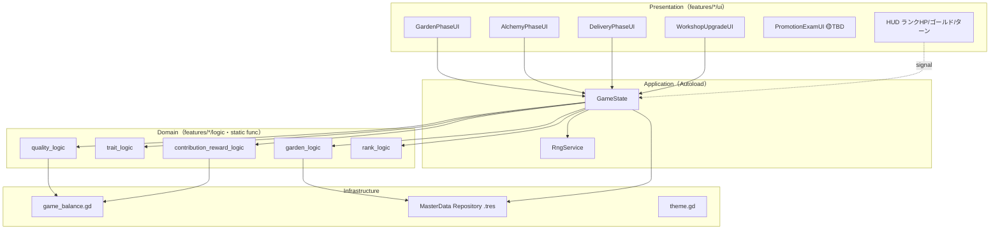
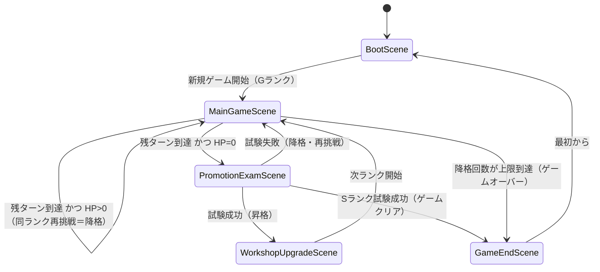

# システムアーキテクチャ設計

準拠要件: [`../../spec/atelier-alchemy-core/requirements.md`](../../spec/atelier-alchemy-core/requirements.md)
準拠コンセプト: [`../../concept/atelier-concept.md`](../../concept/atelier-concept.md)（v7.0・調合主軸モデル）
技術スタック: Godot 4.x + GDScript（[`CLAUDE.md`](../../../CLAUDE.md) の決定に準拠）

> **信頼性レベル凡例**: 🔵 要件/コンセプト文書にほぼ準拠 ／ 🟡 文書からの妥当な推測 ／ 🔴 文書にない新規推測

---

## システム概要

🔵 錬金術師（プレイヤー）が **庭で品質・特性を持つ素材を仕込み（戦略層）**、**調合台の投入枠（4枠）で品質と特性のトレードオフを設計し（戦術層・核心）**、完成した調合物を **ギルドへ自動納品して決算（貢献度＝ランクHP削り／報酬＝ゴールド）** する三段構成のターン制デッキ・リソース管理RPG。ランクHPを制限ターン内に0にすれば昇格試験に挑め、G→F→E→D→C→B→A→S を攻略しきればゲームクリアとなる。

---

## アーキテクチャパターン

- **パターン**: Feature-Based Architecture ＋ Functional Core, Imperative Shell（[`CLAUDE.md`](../../../CLAUDE.md) の2原則をGodotの慣用構造へ翻訳） 🔵
- **理由**:
  - 🔵 機能（庭 / 調合 / ギルド納品 / 工房強化 / ランク進行）ごとに `res://features/{feature}/` へ凝集させ、機能単位の追加・削除を容易にする
  - 🔵 品質計算・特性発現判定・貢献度/報酬算出などの計算ロジックを副作用のない `static func`（`logic/`）に隔離し、テスト容易性（GUT）と再現性（乱数はシード注入）を確保する
  - 🟡 Godot標準の `signal` を EventBus 相当として使い、専用のイベントバスAutoloadは持たない（[`CLAUDE.md`](../../../CLAUDE.md) の対応表に準拠）

---

## レイヤー構造

🔵 4層構造。上位は下位に依存し、逆方向の依存は `signal`（イベント通知）でのみ行う。Domain層（`logic/`）は他のどの層にも依存しない純粋関数の集合。

```
┌─────────────────────────────────────────────┐
│          Presentation Layer                 │
│  res://features/{feature}/ui/*.tscn + *.gd  │
│  - 各フェーズUI（庭 / 調合 / 納品 / 強化）  │
│  - HUD（ランクHPバー・ゴールド・ターン数）  │
│  - 昇格試験画面（🟡 TBD 別途設計）          │
└─────────────────────────────────────────────┘
                    ↓ 呼び出し / ↑ signal
┌─────────────────────────────────────────────┐
│         Application Layer                   │
│  Autoload（シングルトンNode）               │
│  - GameState（唯一の可変状態・進行管理）    │
│  - RngService（シード管理された乱数供給）    │
└─────────────────────────────────────────────┘
                    ↓ 純粋関数呼び出し
┌─────────────────────────────────────────────┐
│           Domain Layer（Functional Core）   │
│  res://features/{feature}/logic/*.gd        │
│  - static func のみ・副作用なし・Node非継承 │
│  - 品質計算 / 特性発現判定 / 貢献度・報酬算出│
│  - 収穫・枯死判定 / 指定合致判定 / 昇降格判定│
└─────────────────────────────────────────────┘
                    ↑ Resource 読み込み
┌─────────────────────────────────────────────┐
│      Infrastructure Layer                   │
│  - MasterData（カスタム Resource + .tres）  │
│  - game_balance.gd（バランス定数）          │
│  - theme.gd（見た目定数）                   │
│  （セーブ/ロードは現バージョンのスコープ外）│
└─────────────────────────────────────────────┘
```

### 各層の責務と配置

| 層 | Godotでの実体 | 責務 | 副作用 |
|----|--------------|------|--------|
| Presentation | `features/{f}/ui/*.tscn` + `*.gd`（Node継承） | 表示・入力受付・`signal`発火 | あり |
| Application | `GameState` / `RngService`（Autoload） | 可変状態の一元管理・進行制御・乱数供給 | あり |
| Domain | `features/{f}/logic/*.gd`（`static func`, Node非継承） | 計算・判定・変換 | **なし** |
| Infrastructure | `Resource`（`.tres`）/ `shared/constants` / `shared/theme` | マスターデータ・定数の提供 | 読み取りのみ |

---

## コンポーネント図



🟡 UIは `GameState` のメソッドを呼び、`GameState` は Domain の純粋関数へ計算を委譲する。計算結果で状態を更新した後、`GameState` は `signal` を発火し、購読しているUI（HUD等）が表示を更新する。

---

## ディレクトリ構造（案）

🔵 [`CLAUDE.md`](../../../CLAUDE.md) の対応表に基づく Godot プロジェクト構成。実装着手時に `atelier-godot/` として新規作成する。

```
atelier-godot/
├── project.godot
├── features/
│   ├── garden/                 # 庭（仕込み層）
│   │   ├── logic/
│   │   │   └── garden_logic.gd        # 生育進行・収穫品質・枯死判定
│   │   └── ui/
│   │       ├── garden_phase_ui.tscn / .gd
│   │       └── seed_slot.tscn / .gd
│   ├── alchemy/                # 調合（主戦場・核心）
│   │   ├── logic/
│   │   │   ├── quality_logic.gd       # 品質平均・品質倍率
│   │   │   └── trait_logic.gd         # 特性発現判定（閾値2個）
│   │   └── ui/
│   │       ├── alchemy_phase_ui.tscn / .gd
│   │       ├── input_slot.tscn / .gd   # 投入枠
│   │       └── product_preview.tscn / .gd
│   ├── guild/                  # ギルド納品（決算・自動）
│   │   ├── logic/
│   │   │   └── contribution_reward_logic.gd  # 貢献度・報酬・指定合致
│   │   └── ui/
│   │       └── delivery_result_ui.tscn / .gd
│   ├── workshop/               # 工房強化・ショップ
│   │   ├── logic/
│   │   │   └── shop_logic.gd           # 購入可否・価格判定
│   │   └── ui/
│   │       ├── workshop_upgrade_ui.tscn / .gd
│   │       └── shop_ui.tscn / .gd
│   └── rank/                   # ランク進行・昇格試験
│       ├── logic/
│       │   └── rank_logic.gd           # HP減算・昇降格・クリア判定
│       └── ui/
│           ├── rank_hud.tscn / .gd
│           └── promotion_exam_ui.tscn / .gd  # 🟡 TBD
├── shared/
│   ├── autoload/
│   │   ├── game_state.gd               # GameState（Autoload登録）
│   │   └── rng_service.gd              # RngService（Autoload登録）
│   ├── constants/
│   │   └── game_balance.gd             # バランス定数
│   ├── theme/
│   │   └── theme.gd                    # 見た目定数
│   ├── data/                           # カスタム Resource 定義
│   │   ├── material_master.gd          # class_name MaterialMaster
│   │   ├── recipe_master.gd            # class_name RecipeMaster
│   │   ├── trait_master.gd             # class_name TraitMaster
│   │   └── material_instance.gd        # 収穫済み素材の実体
│   └── scenes/
│       └── main_game.tscn / .gd        # メインゲームシーン（フェーズUI統括）
├── resources/                          # .tres マスターデータ実体
│   ├── materials/
│   ├── recipes/
│   └── traits/
└── tests/                              # GUT
    ├── unit/
    │   ├── alchemy/
    │   ├── garden/
    │   ├── guild/
    │   └── rank/
    └── integration/
```

---

## Autoload（Application層）の設計

🔵 [`CLAUDE.md`](../../../CLAUDE.md) の対応表に準拠。専用EventBus Autoloadは持たず、`GameState` の `signal` で通知する。

| Autoload | 種別 | 責務 |
|----------|------|------|
| `GameState` | シングルトンNode | ゲーム全体の唯一の可変状態（ランク・HP・残ターン・ゴールド・在庫・庭・恒久投資・降格回数）を保持し、状態遷移メソッドと `signal` を提供 |
| `RngService` | シングルトンNode | シード管理された乱数を供給（収穫時の特性付与・日替わり指定生成）。Domain層は乱数を持たず、必要な乱数値は引数で受け取る |

### GameState が発火する主要 signal 🟡

| signal | 発火タイミング | 主なペイロード |
|--------|--------------|---------------|
| `phase_changed` | フェーズUI切替時 | `new_phase: GamePhase` |
| `turn_advanced` | ターン終了時 | `turn: int`, `remaining_turns: int` |
| `rank_hp_changed` | 納品でHP減少時 | `previous: int`, `current: int`, `delta: int` |
| `gold_changed` | 報酬獲得・購入時 | `previous: int`, `current: int`, `delta: int` |
| `product_delivered` | 調合物の自動納品時 | `product`, `contribution`, `reward`, `matched: bool` |
| `rank_cleared` | 制限ターン内にHP0達成時 | `rank: GuildRank` |
| `rank_demoted` | 昇格試験失敗時 | `rank`, `demotion_count: int` |
| `game_over` | 降格回数が上限到達時 | `rank` |
| `game_cleared` | Sランク昇格試験クリア時 | — |

---

## シーン構成

🟡 セーブ/ロード・タイトル画面・設定画面は現バージョンのスコープ外（[`requirements.md`](../../spec/atelier-alchemy-core/requirements.md) 概要・2章）。よって最小限のシーン構成とする。庭・調合・納品はシーン分割せず、**メインゲームシーン内のフェーズUIの表示切替**で表現する（フェーズはPhaser版のような画面ではなくUIパネルの可視制御）。

| シーン名 | 説明 | 主要な要素 |
|---------|------|-----------|
| **BootScene** | 初期化・マスターデータ読込・新規ゲーム状態生成 | - `.tres` 一括ロード<br>- `GameState` 初期化 |
| **MainGameScene** | ターンループの主画面（庭/調合/納品フェーズUIを内包） | - GardenPhaseUI<br>- AlchemyPhaseUI<br>- DeliveryResultUI<br>- RankHUD |
| **WorkshopUpgradeScene** | ランク間の工房強化（恒久投資） | - 投入枠+1 / 庭拡張 / レシピ解禁 |
| **PromotionExamScene** | 昇格試験（一発勝負の特殊局面・専用ルール） | - 🟡 TBD（別途設計） |
| **GameEndScene** | クリア/ゲームオーバー表示 | - 結果表示<br>- BootSceneへ戻る |

> 🔵 `BootScene` は「設定データ読み込み・セーブデータ確認」を含む標準テンプレートだが、本プロジェクトではセーブがスコープ外のため **マスターデータのロードと新規状態生成のみ**を担う。

---

## シーン遷移図



> 🔵 「降格」はランク文字が下がることではなく、**同一ランクに留まっての再挑戦**を指す（[`requirements.md`](../../spec/atelier-alchemy-core/requirements.md) 2章）。ゲーム全体ループは常に昇格方向の一方向で進む。

---

## 技術的決定事項

| 項目 | 決定 | 根拠 |
|------|------|------|
| エンジン | Godot 4.x（実装着手時の最新安定版） | 🔵 [`CLAUDE.md`](../../../CLAUDE.md) |
| 言語 | GDScript | 🔵 同上 |
| ユニットテスト | GUT（Godot Unit Test） | 🔵 同上 |
| 状態管理 | `GameState` Autoload（Single Source of Truth） | 🔵 対応表 |
| イベント通知 | Godotネイティブ `signal`（専用EventBus無し） | 🔵 対応表 |
| 純粋関数 | `features/{f}/logic/*.gd` の `static func` | 🔵 対応表 |
| マスターデータ | カスタム `Resource`（`class_name` + `.tres`） | 🔵 対応表 |
| 乱数 | `RngService` に集約・シード注入で再現可能 | 🔵 収穫特性は「分散のみ・期待値不動」（[`requirements.md`](../../spec/atelier-alchemy-core/requirements.md) 4章） |
| セーブ/ロード | 現バージョン未実装（スコープ外） | 🔵 [`requirements.md`](../../spec/atelier-alchemy-core/requirements.md) 概要 |

---

## 参考文書

- コアシステム詳細: [`core-systems.md`](core-systems.md)
- データフロー: [`dataflow.md`](dataflow.md)
- ゲームメカニクス: [`game-mechanics.md`](game-mechanics.md)
- バランス設計: [`balance-design.md`](balance-design.md)
- データスキーマ: [`data-schema.md`](data-schema.md)
- インターフェース定義: [`interfaces.gd`](interfaces.gd)
- UI設計: [`ui-design/overview.md`](ui-design/overview.md)
