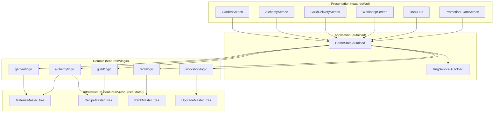
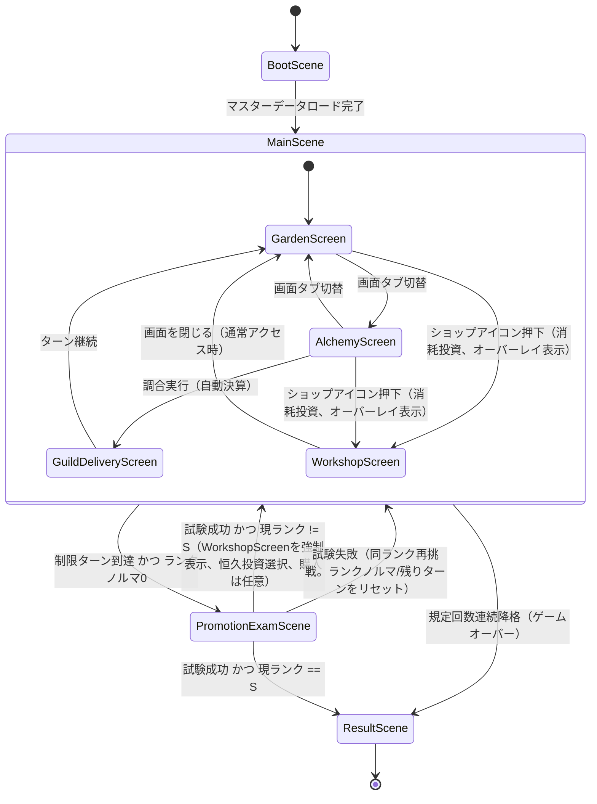

# システムアーキテクチャ設計

作成日: 2026-08-04
準拠要件: [`../../spec/atelier-alchemy-core/requirements.md`](../../spec/atelier-alchemy-core/requirements.md)

> ⚠️ 本文書を含む `docs/design/atelier-alchemy-core/` 配下一式は本コミットで新規作成した。旧 `CLAUDE.md` は `architecture.md` 等を「最新」として参照していたが、本リポジトリ・git履歴のいずれにも実体は存在しなかった（別環境の作業記録がドキュメント上に混入していたと推測される）。本文書が実質的な初版である。

## システム概要

「Atelier」は、庭（仕込み層）→調合（主戦場）→ギルド納品（決算）の三段構成で進行するデッキ・リソース管理RPG。プレイヤーは品質と特性を持つ素材を庭で仕込み、調合台の投入枠（4枠）で「品質を盛るか特性を宿すか」のトレードオフをしながら調合物を作り、ギルドへ自動納品してランクのノルマをこなしていく。詳細なゲームルールは[`game-mechanics.md`](./game-mechanics.md)を参照。

## アーキテクチャパターン

- パターン: Feature-Based Architecture + Functional Core, Imperative Shell
- 理由: 本プロジェクトの `.claude/rules/architecture.md` が全プロジェクト共通方針として定めており、`CLAUDE.md`（2026-07-09時点の技術選定）でもGodotへの翻訳方針が明記されている。品質計算・特性発現判定・貢献度/報酬算出といった純粋関数群（Functional Core）と、シーン・Autoload等の副作用を持つ層（Imperative Shell）を分離することで、ロジックのユニットテスト容易性を確保する

🔵 この方針は `.claude/rules/architecture.md` および `CLAUDE.md` に明記された確定事項であり、本文書の推測ではない。

## 対応表（プロジェクト共通概念 → Godot実装）

| 概念 | Godotでの対応 |
|---|---|
| StateManager | `GameState` Autoload（シングルトンNode） |
| EventBus | Godotネイティブの `signal`（専用Autoloadは持たない。発行元ノードが `signal` を宣言し、購読側が `connect()` する） |
| RNGサービス | `RngService` Autoload（`RandomNumberGenerator` をラップし、シード管理を一元化） |
| 純粋関数（services相当） | `res://features/{feature}/logic/*.gd`（`class_name` 付きの `static func` 集合、Node非継承） |
| UIコンポーネント | `res://features/{feature}/ui/*.tscn` + `*.gd`（`Control` 継承） |
| GAME_CONFIG / THEME | `res://shared/constants/game_balance.gd` / `res://shared/theme/theme.gd`（いずれも `class_name` 付き、定数のみを持つ静的クラス） |
| マスターデータ（素材・レシピ・特性・ランク等） | カスタム `Resource`（`class_name` + `.tres`） |
| インスタンスデータ（素材個体・調合物個体） | プレーンな `RefCounted` 継承クラス（`class_name` 付き。`Resource` ではなくインスタンスごとに使い捨てるため） |

🔵 上記表は `CLAUDE.md` の既存記述を踏襲している。RNGサービス行のみ本文書で明確化した🟡新規追記（要件定義書 §4「素材（Material）」の「乱数は分散のみで期待値は動かさない」を満たすための一元管理ポイントとして必要）。

🟡 **2026-08-05修正**: PRレビュー（Naming/Warning#3）で、`class_name`なしと規定しながら全文書で`QualityCalculator.calculate_quality(...)`のようなグローバル識別子呼び出しを前提にしていた矛盾が指摘されたため、`logic/*.gd`も`class_name`付きに統一した。インターフェース定義については引き続き作成しない方針（本文書「インターフェース定義について」参照。`class_name`付与とインターフェースの要否は別問題であり、多態性が不要という判断は変わらない）。

## レイヤー構造

```
┌─────────────────────────────────────────────┐
│          Presentation Layer                  │
│  res://features/{feature}/ui/*.tscn + *.gd   │
│  - 各画面のControlノード（GardenScreen等）    │
│  - signal発行、GameState参照（読み取りのみ）  │
└─────────────────────────────────────────────┘
                    ↓↑ signal / GameState.get_state()
┌─────────────────────────────────────────────┐
│         Application Layer                    │
│  res://autoload/*.gd                          │
│  - GameState（状態の一元管理・更新API）       │
│  - RngService（乱数の一元管理）               │
└─────────────────────────────────────────────┘
                    ↓↑ 関数呼び出し（引数渡し・戻り値受け取りのみ）
┌─────────────────────────────────────────────┐
│           Domain Layer                       │
│  res://features/{feature}/logic/*.gd          │
│  - QualityCalculator, TraitActivation 等      │
│  - 副作用なし（static func、Node非継承）      │
└─────────────────────────────────────────────┘
                    ↓↑ Resourceのロード・参照
┌─────────────────────────────────────────────┐
│      Infrastructure Layer                    │
│  res://features/{feature}/resources/*.gd      │
│  res://data/**/*.tres                         │
│  - マスターデータ定義（Resourceスクリプト）   │
│  - .tresファイル（実データ）                  │
└─────────────────────────────────────────────┘
```

### レイヤー間の依存ルール

- Presentation → Application, Domain, Infrastructure（すべて参照可）
- Application → Domain, Infrastructure（参照可）。Presentationは参照しない
- Domain → Infrastructure（マスターデータ型の参照のみ可）。Application・Presentationは参照しない（副作用のある層に依存させない）
- Infrastructure → 他レイヤーに依存しない

🔵 `.claude/rules/architecture.md` の「Functional Core内での副作用禁止」「Imperative Shell内での複雑なビジネスロジック禁止」を階層依存ルールとして明文化したもの。

### 検証責務のレイヤー配置原則（🟡2026-08-05追加。PRレビューのCross-Cutting Analysisを反映）

PRレビューで「ビジネスルール制約の強制がPresentation層のみに依存している」「投入枠上限や在庫の重複投入を検証するDomain層の関数が存在しない」等、検証責務がどのレイヤーに属するか未定義な箇所が複数指摘された。以下を全設計文書共通の原則として定める。

- **Presentation層**: 操作の抑止（ボタンの無効化等）を行う。これはあくまで「先出しフィードバック」であり、正当性の最終担保ではない
- **Application層（`GameState`）**: 状態を変更する直前に、Domain層の判定関数を**必ず再評価**する（UIの判定結果を信頼しない）。例: 購入実行前に`PurchaseValidator.can_purchase`を再評価する、`execute_alchemy`実行前に投入枠数・在庫所有・重複を再検証する
- **Domain層（`logic/*.gd`）**: 純粋な判定ロジックを提供する（`SlotState.can_execute`等）。副作用は持たない
- **Infrastructure層**: 起動時（BootScene）にマスターデータ間のID相互参照が解決可能かを検証し、未解決参照があれば起動を停止する

この原則は、[`core-systems.md`](./core-systems.md) の各システムの主要メソッド仕様、および[`dataflow.md`](./dataflow.md) の各シーケンス図に個別に反映する。

## コンポーネント図



## シーン構成

Godotでは「シーン」がPhaserの`Scene`に相当するが、本ゲームはターン制でシーン遷移が少ないため、1つの永続シーン（`Main.tscn`）の中でUI（`Control`ノード）の表示/非表示を切り替える構成を採る。

| シーン/画面 | 説明 | 主要な要素 |
|---|---|---|
| **BootScene** (`boot.tscn`) | 初期化。マスターデータ（`.tres`）の事前ロード確認 | `preload`/`load`によるResource読み込み |
| **MainScene** (`main.tscn`) | 常駐シーン。以下の画面をすべて子`Control`として保持し、表示切替で画面遷移を表現 | `GardenScreen` / `AlchemyScreen` / `GuildDeliveryScreen` / `WorkshopScreen` / `RankHud`（常時表示） |
| **PromotionExamScene** | 昇格試験専用の特殊局面。庭なし・専用試験ノルマ・超短期ターンで通常の調合/納品ループを流用する（🔵2026-08-04ヒアリングで確定） | [`core-systems.md`](./core-systems.md) RankSystem節・[`game-mechanics.md`](./game-mechanics.md) 参照。数値（試験ノルマ難度係数等）は🟡TBD |
| **ResultScene** (`result.tscn`) | ゲームクリア（Sランク昇格試験成功）／ゲームオーバー（規定回数降格）時の終了画面 | スコア表示のみ（詳細🟡TBD） |

🟡 要件定義書はタイトル画面・設定画面・セーブロード画面を明示的にスコープ外としている（`CLAUDE.md`「技術スタック」節参照。参照元の`design-interview.md`自体は本リポジトリに存在しないため、この決定の一次ソースは要件定義書冒頭の記述のみに依拠する）。本文書ではこれらのシーンを設計しない。

## シーン遷移図



🔵 **2026-08-05修正（PRレビューCritical#2対応）**: 旧版は `MainScene --> WorkshopScene: ランクノルマ0到達` → `WorkshopScene --> PromotionExamScene` という、他の全文書（`dataflow.md`／`core-systems.md`／`ui-design/overview.md`）と逆順の経路を含んでおり、同一図内で「制限ターン到達かつノルマ0で試験へ」という正しい経路と矛盾していた。

🔴 **2026-08-06修正（実装レディネス監査対応）**: 上記2026-08-05修正時点でも、`WorkshopScene`を`PromotionExamScene`からのみ到達可能な独立トップレベルstateとして描いており、本文書「シーン構成」表が`WorkshopScreen`を**MainSceneの子Control**（`GardenScreen`等と同格）と明記していることと矛盾していた。また`ui-design/overview.md`の画面遷移図が定義する「庭/調合画面からショップへいつでも行ける」経路（消耗投資はターン中いつでも購入可能、要件定義書§3参照）の実体もこの図から欠落していた。`WorkshopScreen`を`MainScene`のcomposite state内に子として再配置し、`GardenScreen`/`AlchemyScreen`からのオーバーレイ遷移を追加した。昇格試験成功後の強制表示（恒久投資選択）は、シーン遷移ではなく`MainScene`復帰時に`WorkshopScreen`を自動的に開く**画面内の状態**として表現する（[`ui-design/screens/workshop-shop.md`](./ui-design/screens/workshop-shop.md) の「通常アクセス状態」「昇格直後の強制表示状態」参照）。

🟡 「画面タブ切替」でGardenScreenとAlchemyScreenを自由に行き来できる設計とした（要件定義書に画面遷移の明示規定がないため）。庭と調合は同一ターン内で何度でも行き来して構わない設計だが、この解釈は要件定義書に明記がなく本文書での推測。異なる場合は要件定義書側の追記が必要。

## ディレクトリ構造（案）

```
atelier-godot/
├── project.godot
├── autoload/
│   ├── game_state.gd            # GameState Autoload（class_name不要、Autoload名で参照）
│   └── rng_service.gd           # RngService Autoload
├── features/
│   ├── garden/                  # 庭（仕込み層）
│   │   ├── logic/
│   │   │   ├── planting.gd            # 種植え・スロット管理（static func）
│   │   │   ├── harvest.gd             # 収穫・品質確定・枯死解決（static func）
│   │   │   └── trait_roll.gd          # 特性乱数付与（static func、乱数は引数で受け取る）
│   │   ├── state/
│   │   │   ├── garden_state.gd        # class_name GardenState extends RefCounted
│   │   │   └── plant_state.gd         # class_name PlantState extends RefCounted
│   │   ├── resources/
│   │   │   └── seed_master.gd         # class_name SeedMaster extends Resource
│   │   └── ui/
│   │       ├── garden_screen.tscn
│   │       └── garden_screen.gd
│   ├── alchemy/                 # 調合（主戦場）
│   │   ├── logic/
│   │   │   ├── quality_calculator.gd  # 品質計算（投入素材の平均、四捨五入、触媒+1）
│   │   │   ├── trait_activation.gd    # 特性発現判定（閾値2個）
│   │   │   └── product_value_calculator.gd # 貢献度/報酬算出（指定合致ボーナスは含まない）
│   │   ├── state/
│   │   │   └── slot_state.gd          # class_name SlotState extends RefCounted
│   │   ├── resources/
│   │   │   ├── material_master.gd     # class_name MaterialMaster extends Resource
│   │   │   └── recipe_master.gd       # class_name RecipeMaster extends Resource
│   │   └── ui/
│   │       ├── alchemy_screen.tscn
│   │       ├── alchemy_screen.gd
│   │       └── slot_view.gd           # 投入枠1つ分のUI部品
│   ├── guild/                   # ギルド納品（決算・自動）
│   │   ├── logic/
│   │   │   └── delivery_resolver.gd   # 納品判定・指定合致ボーナス算出（🔵一本化、core-systems.md参照）
│   │   ├── state/
│   │   │   └── delivery_result.gd     # class_name DeliveryResult extends RefCounted
│   │   ├── resources/
│   │   │   └── daily_order_master.gd  # class_name DailyOrderMaster extends Resource
│   │   └── ui/
│   │       ├── guild_delivery_screen.tscn
│   │       └── guild_delivery_screen.gd
│   ├── workshop/                # 工房強化・ショップ
│   │   ├── logic/
│   │   │   └── purchase_validator.gd  # 購入可否判定（ゴールド比較+重複購入上限）
│   │   ├── resources/
│   │   │   └── upgrade_master.gd      # class_name UpgradeMaster extends Resource
│   │   └── ui/
│   │       ├── workshop_screen.tscn
│   │       └── workshop_screen.gd
│   └── rank/                    # ランク進行・昇格試験
│       ├── logic/
│       │   ├── rank_quota_resolver.gd # ランクノルマ減少・0クランプ・再挑戦時リセット
│       │   ├── turn_limit_resolver.gd # 制限ターン到達判定（🔴2026-08-06追加、旧版はcore-systems.mdのクラス図にのみ存在しディレクトリ構造案に配置漏れがあった）
│       │   └── promotion_exam_resolver.gd  # ExamState管理・AlchemySystem/GuildSystemを流用（🔵確定、数値は🟡TBD）
│       ├── state/
│       │   ├── rank_state.gd          # class_name RankState extends RefCounted
│       │   └── exam_state.gd          # class_name ExamState extends RefCounted
│       ├── resources/
│       │   └── rank_master.gd         # class_name RankMaster extends Resource
│       └── ui/
│           ├── rank_hud.gd            # 常時表示のランクノルマバー等
│           └── promotion_exam_screen.tscn/gd  # alchemy_screen.tscnのUIをほぼ再利用
├── shared/
│   ├── constants/
│   │   └── game_balance.gd      # class_name GameBalance（TBD数値もここに定数として仮置き）
│   ├── theme/
│   │   └── theme.gd             # class_name UiTheme
│   └── entities/
│       ├── material_instance.gd # class_name MaterialInstance extends RefCounted
│       └── product_instance.gd  # class_name ProductInstance extends RefCounted
├── data/
│   ├── materials/*.tres
│   ├── recipes/*.tres
│   ├── ranks/*.tres
│   ├── upgrades/*.tres
│   └── daily_orders/*.tres
├── scenes/
│   ├── boot.tscn
│   ├── main.tscn
│   └── result.tscn
└── tests/                       # GUT
    └── unit/
        └── features/
            ├── garden/
            ├── alchemy/
            ├── guild/
            ├── workshop/
            └── rank/
```

🟡 このディレクトリ構造は本文書での新規提案。`CLAUDE.md`の「アーキテクチャ方針」節は「`architecture.md`内「ディレクトリ構造（案）」を参照」と本文書の存在を前提に書かれていたが、実体がなかったため今回新規に確定した。

🔵 **2026-08-05修正（PRレビューWarning対応）**: `core-systems.md`のクラス図に登場する状態型（`GardenState`/`PlantState`/`SlotState`/`RankState`/`ExamState`/`DeliveryResult`）の配置先が旧版のディレクトリ構造になく、`shared/entities/`の`MaterialInstance`/`ProductInstance`しか明記されていなかった。各Featureに`state/`ディレクトリを追加し配置先を明記した（複数Featureにまたがる`MaterialInstance`/`ProductInstance`のみ`shared/entities/`に残す）。

## インターフェース定義について

GDScriptには C# の `interface` に相当する言語機能がなく、Godotコミュニティの一般的な慣習でも抽象インターフェースを独立ファイルとして定義することは少ない（ダックタイピング、または「未実装なら `push_error` を出す基底クラス」パターンが一般的）。本プロジェクトでは以下の理由から独立した `interfaces.gd` を作成しない。

- `logic/*.gd` は `static func` の集合であり、そもそもインスタンス化・多態性を必要としない（インターフェースを介した差し替えの需要がない）
- `GameState` / `RngService` はAutoloadとして単一実装のみ存在し、テスト時はGUTの `double()`（モック機能）で代替する。テスト用の別実装を用意する目的でのインターフェース定義も不要

🟡 これは本文書での技術判断。将来的にマスターデータのロード元を差し替える（例: `.tres`→リモート配信）等の要件が生じた場合は、その時点で該当箇所のみインターフェース化を検討する。

## テスト戦略

| 部分 | テスト方法 | カバレッジ目標 |
|------|-----------|--------------|
| Domain（`logic/*.gd`） | GUTユニットテスト（モック不要、純粋関数のため入出力のみ検証） | 90%+ |
| Application（Autoload） | GUT統合テスト（シーンツリーに読み込んでAutoload経由で検証） | 70%+ |
| Presentation（UI） | GUTのシーンテスト、または手動プレイテスト | クリティカルパスのみ |

🔵 `.claude/rules/testing.md` のカバレッジ目標をGodot/GUT向けに翻訳したもの。GUT採用は `CLAUDE.md` で確定済み。

### テスト運用規約（🔴2026-08-05追加、PRレビューWarning対応）

- **ファイル命名**: `tests/unit/features/{feature}/test_{対象}.gd`（GUTの既定規則 `test_*.gd`、`extends GutTest`）
- **統合テストの配置**: `tests/integration/`（ディレクトリ構造案に未反映だった。`.claude/rules/testing.md`の`tests/unit/`・`tests/integration/`分離方針に合わせる）
- **実行コマンド**: `godot --headless -s addons/gut/gut_cmdln.gd`（🟡具体的なCLIオプションは実装着手時に確定）
- **カバレッジ計測**: GDScript/GUTには標準のカバレッジ計測機構がない。計測プラグインを別途導入するか、「`logic/*.gd`の全public `static func`に正常系・異常系・境界値のテストを最低1本ずつ持つ」という数え上げ可能な基準に置き換えるかは🟡TBD（個人開発規模では後者が現実的）
- **RNGのテスト方針**: Domain層（`logic/*.gd`）は乱数値を引数で受け取るため、テストにモック（GUTの`double()`）は不要（純粋関数として値を直接渡せばよい）。`double()`はApplication層（Autoload）の統合テストで`RngService`を差し替える場合にのみ使う
