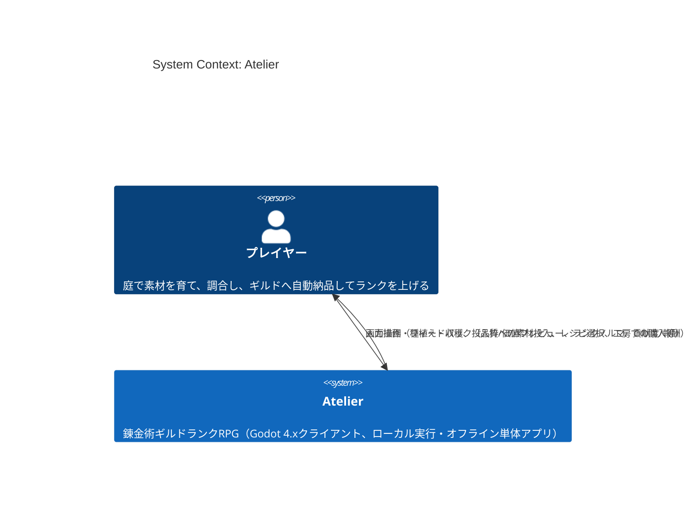
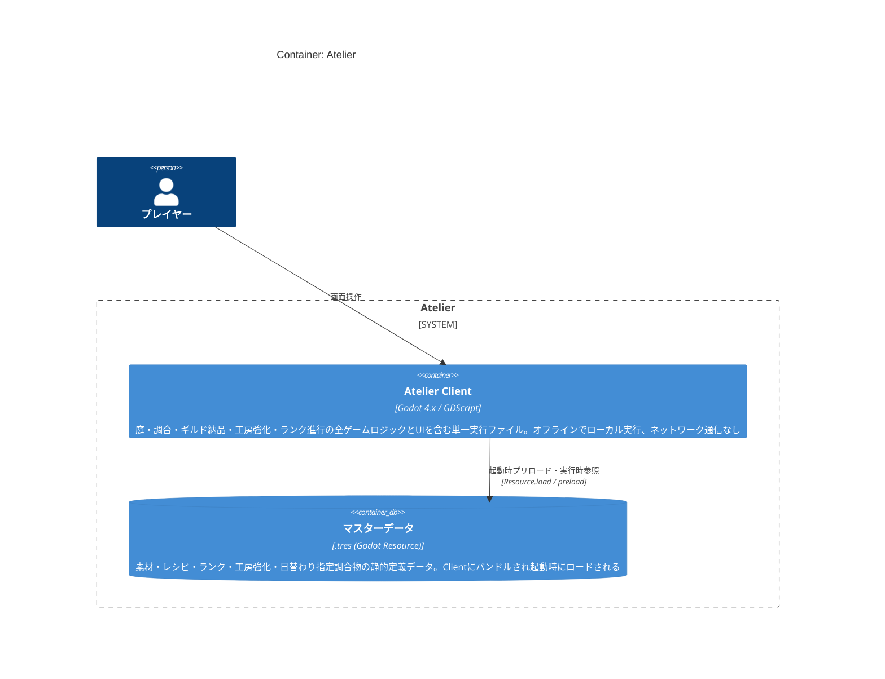

# C4モデル

作成日: 2026-08-06
準拠文書: [`architecture.md`](./architecture.md) / [`core-systems.md`](./core-systems.md) / [`dataflow.md`](./dataflow.md)

> ⚠️ 本文書作成時点（2026-08-06）で実装コードは存在しない。以下はすべて設計文書（`architecture.md`・`core-systems.md`）に基づく**設計時点のC4モデル**であり、実装完了後は実コードとの整合性を再確認・更新すること。

## 凡例

他の設計文書と同じ確度表示規則に従う。

| 記号 | 意味 |
|---|---|
| 🔵 | 既存設計文書（`architecture.md`・`core-systems.md`）に明記済みの内容をC4記法に翻訳したもの |
| 🟡 | 本文書での新規整理・推測（既存文書に直接の記載がない粒度の判断） |

## C4モデルとは（本文書での位置付け）

[C4モデル](https://c4model.com/)はソフトウェアアーキテクチャを4つの抽象度（Context → Container → Component → Code）で段階的に詳細化して可視化する手法。本プロジェクトは**単一のGodotクライアント実行ファイルとして完結し、外部システム連携を持たない**ため、Context/Containerレベルは簡素な構成になる。実質的な核心は Component レベル（`architecture.md`のレイヤー構造+コンポーネント図の翻訳）であり、Code レベルは既存のクラス図（`core-systems.md`）を参照する形で代替する。

---

## C1: システムコンテキスト図

🟡 本ゲームはオフライン・シングルプレイのローカル実行アプリであり、外部API・認証基盤・分析基盤等の外部システムを持たない（セーブ/ロード機能自体が設計スコープ外、`CLAUDE.md`参照）。そのためコンテキスト図は「プレイヤー ⇄ Atelier」の1対1のみで構成される。

🟡 セーブ/ロード・タイトル画面・設定画面は現行スコープ外（`CLAUDE.md`「技術スタック」節）のため、外部永続化システム（クラウドセーブ等）はコンテキストに含めない。将来これらがスコープに入った場合、この図に該当する外部システムボックスを追加する。

---

## C2: コンテナ図

🟡 C4モデルにおける「コンテナ」は本来「独立してデプロイ可能な実行単位」を指すが、本プロジェクトはGodotの単一エクスポート実行ファイルであり、技術的には常に1コンテナに収まる。マスターデータ（`.tres`）はクライアントにバンドルされる静的データであり別デプロイ単位ではないが、`architecture.md`のInfrastructure層が独立した責務を持つことを可視化する目的で、データストア的な扱いとして分けて図示する。

🔵 起動時（BootScene）にマスターデータ間のID相互参照が解決可能かを検証し、未解決参照があれば起動を停止する方針が`architecture.md`「検証責務のレイヤー配置原則」に明記されている。これはClientコンテナとマスターデータの結合点における唯一のI/O境界であり、実行時に外部ネットワークやDBへのアクセスは発生しない。

---

## C3: コンポーネント図（Atelier Client内部）

🔵 `architecture.md`の4層構造（Presentation → Application → Domain → Infrastructure）とそのレイヤー間依存ルールをC4記法に翻訳したもの。内容は`architecture.md`「コンポーネント図」のMermaid `graph TB`と等価だが、`core-systems.md`で定義された`DailyOrderMaster`（GuildSystemが参照するマスターデータ）を追加している（🟡本文書での補完。`architecture.md`のコンポーネント図には含まれていなかったが、`core-systems.md`の`guild/resources/daily_order_master.gd`および`DeliveryResolver.matches_order`の引数として明記されている）。

```mermaid
C4Component
    title Component: Atelier Client（内部レイヤー構成）

    Container_Boundary(client, "Atelier Client") {
        Boundary(presentation, "Presentation Layer (features/*/ui)") {
            Component(gardenUi, "GardenScreen", "Control (.tscn/.gd)", "庭の種植え・生育状況・収穫UI")
            Component(alchemyUi, "AlchemyScreen", "Control (.tscn/.gd)", "調合台・投入枠・品質/価値プレビューUI ★核心画面")
            Component(guildUi, "GuildDeliveryScreen", "Control (.tscn/.gd)", "納品結果表示UI（自動決算の結果のみ表示、操作なし）")
            Component(workshopUi, "WorkshopScreen", "Control (.tscn/.gd)", "恒久投資・消耗投資の購入UI")
            Component(rankHud, "RankHud", "Control (.tscn/.gd)", "常時表示のランクノルマ・残ターン表示")
            Component(examUi, "PromotionExamScreen", "Control (.tscn/.gd)", "昇格試験専用UI（AlchemyScreenのUIをほぼ再利用）")
        }

        Boundary(application, "Application Layer (autoload)") {
            Component(gameState, "GameState", "Autoload (Singleton Node)", "状態の一元管理。更新APIを提供し、実行直前にDomain層の判定を再検証する（UIの判定結果を信頼しない）")
            Component(rngService, "RngService", "Autoload (Singleton Node)", "乱数の一元管理。RandomNumberGeneratorをラップしシードを一元管理")
        }

        Boundary(domain, "Domain Layer (features/*/logic)") {
            Component(gardenLogic, "GardenSystem", "static func群", "種植え・生育進行・収穫・特性付与（Planting / Harvest / TraitRoll）")
            Component(alchemyLogic, "AlchemySystem", "static func群", "投入枠管理・品質計算・特性発現判定・価値算出（QualityCalculator / TraitActivation / ProductValueCalculator） ★ゲームの核心")
            Component(guildLogic, "GuildSystem", "static func群", "納品の自動決算・指定合致判定（DeliveryResolver）")
            Component(workshopLogic, "WorkshopSystem", "static func群", "購入可否判定（PurchaseValidator）")
            Component(rankLogic, "RankSystem", "static func群", "ランクノルマ・制限ターン・昇格試験管理（RankQuotaResolver / TurnLimitResolver / PromotionExamResolver）")
        }

        Boundary(infrastructure, "Infrastructure Layer (features/*/resources, data/)") {
            ComponentDb(materialMaster, "MaterialMaster", ".tres", "素材マスタ")
            ComponentDb(recipeMaster, "RecipeMaster", ".tres", "レシピマスタ")
            ComponentDb(rankMaster, "RankMaster", ".tres", "ランクマスタ")
            ComponentDb(upgradeMaster, "UpgradeMaster", ".tres", "工房強化マスタ")
            ComponentDb(dailyOrderMaster, "DailyOrderMaster", ".tres", "日替わり指定調合物マスタ")
        }
    }

    Rel(gardenUi, gameState, "signal発行 / get_state()")
    Rel(alchemyUi, gameState, "signal発行 / get_state()")
    Rel(guildUi, gameState, "get_state()")
    Rel(workshopUi, gameState, "signal発行 / get_state()")
    Rel(rankHud, gameState, "get_state()")
    Rel(examUi, gameState, "signal発行 / get_state()")

    Rel(gameState, gardenLogic, "関数呼び出し（引数渡し・戻り値受け取りのみ）")
    Rel(gameState, alchemyLogic, "関数呼び出し")
    Rel(gameState, guildLogic, "関数呼び出し")
    Rel(gameState, workshopLogic, "関数呼び出し")
    Rel(gameState, rankLogic, "関数呼び出し")
    Rel(gameState, rngService, "乱数取得（品質上昇判定・特性抽選）")

    Rel(gardenLogic, materialMaster, "参照")
    Rel(alchemyLogic, materialMaster, "参照")
    Rel(alchemyLogic, recipeMaster, "参照")
    Rel(guildLogic, dailyOrderMaster, "参照")
    Rel(rankLogic, rankMaster, "参照")
    Rel(workshopLogic, upgradeMaster, "参照")

    UpdateLayoutConfig($c4ShapeInRow="4", $c4BoundaryInRow="1")
```

### レイヤー間依存ルール（🔵`architecture.md`より転記）

- **Presentation → Application, Domain, Infrastructure**（すべて参照可）
- **Application → Domain, Infrastructure**（参照可）。Presentationは参照しない
- **Domain → Infrastructure**（マスターデータ型の参照のみ可）。Application・Presentationは参照しない（副作用のある層に依存させない）
- **Infrastructure → 他レイヤーに依存しない**

### Domain層システム間は互いを参照しない（🔵`core-systems.md`より転記）

上記コンポーネント図では省略しているが、`GardenSystem` / `AlchemySystem` / `GuildSystem` / `WorkshopSystem` / `RankSystem` の5システムは**互いを直接参照しない**。すべてのデータ受け渡しは`GameState`（Application層）が仲介する一方向フローであり、`core-systems.md`「システム間相互作用まとめ」で明示的に確定している（旧版で`Guild⇄Rank`の循環依存があったことをPRレビューで指摘・修正した経緯がある）。

### 検証責務の二重化（🔵`architecture.md`「検証責務のレイヤー配置原則」より転記）

- **Presentation層**: 操作の抑止（ボタン無効化等）＝先出しフィードバックのみ。正当性の最終担保ではない
- **Application層（`GameState`）**: 状態を変更する直前に、Domain層の判定関数を**必ず再評価**する（UIの判定結果を信頼しない）
- **Domain層**: 純粋な判定ロジックのみを提供する。副作用は持たない
- **Infrastructure層**: 起動時にマスターデータ間のID相互参照を検証し、未解決参照があれば起動を停止する

---

## C4: コード図（既存クラス図を参照）

🟡 Code レベル（個々のクラス・関数のシグネチャ）は`core-systems.md`に既にシステムごとのMermaid `classDiagram`として詳細に定義されているため、本文書では重複作成せず参照のみとする。

| Domainコンポーネント | 対応するクラス図の節 |
|---|---|
| GardenSystem | [`core-systems.md`「GardenSystem（庭）詳細設計」](./core-systems.md#gardensystem庭詳細設計)（`Planting` / `Harvest` / `TraitRoll` / `MaterialInstance`） |
| AlchemySystem | [`core-systems.md`「AlchemySystem（調合）詳細設計」](./core-systems.md#alchemysystem調合詳細設計-ゲームの核心)（`QualityCalculator` / `TraitActivation` / `ProductValueCalculator` / `SlotState` / `ProductInstance`） |
| GuildSystem | [`core-systems.md`「GuildSystem（ギルド納品）詳細設計」](./core-systems.md#guildsystemギルド納品詳細設計)（`DeliveryResolver` / `DeliveryResult`） |
| WorkshopSystem | [`core-systems.md`「WorkshopSystem（工房強化・ショップ）詳細設計」](./core-systems.md#workshopsystem工房強化ショップ詳細設計)（`PurchaseValidator` / `UpgradeMaster`） |
| RankSystem | [`core-systems.md`「RankSystem（ランク進行・昇格試験）詳細設計」](./core-systems.md#ranksystemランク進行昇格試験詳細設計)（`RankQuotaResolver` / `TurnLimitResolver` / `PromotionExamResolver` / `ExamState` / `ExamOutcome` / `RankOutcome`） |

実装ファイルパスの対応（`features/{feature}/logic/*.gd`）は[`architecture.md`「ディレクトリ構造（案）」](./architecture.md#ディレクトリ構造案)を参照。

---

## 未確定事項・今後の更新方針

- 🟡 本文書はGodotプロジェクト（`atelier-godot/`）のスキャフォールディング前に作成した設計時点のモデルである。実装着手後、ファイル構成やクラス名が設計から変更された場合は本文書も追随して更新すること
- 🟡 セーブ/ロード機能が将来スコープに入った場合、C1（外部永続化システムの追加）・C2（セーブデータストアのコンテナ追加）の両方に影響する
- 🔴 バランス数値（🟡TBD項目）自体はC4モデルの対象外。[`balance-design.md`](./balance-design.md)を参照
