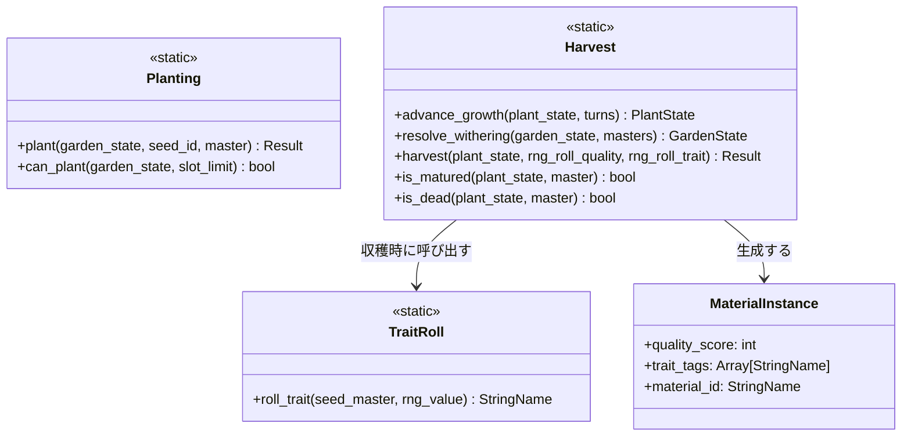
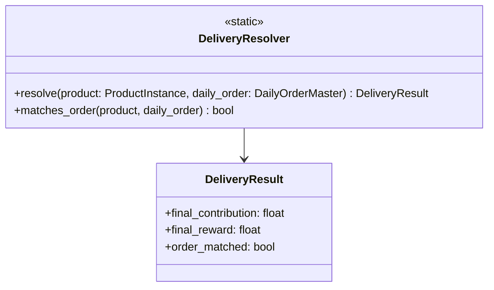
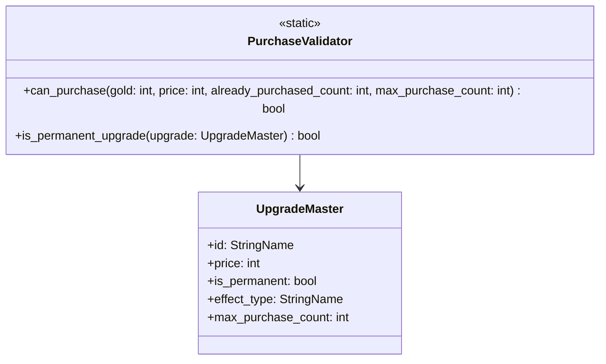
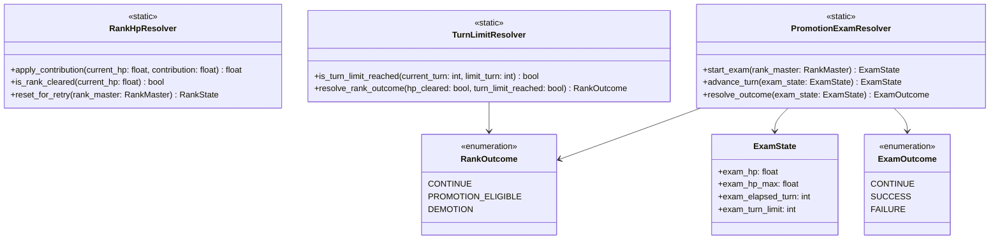
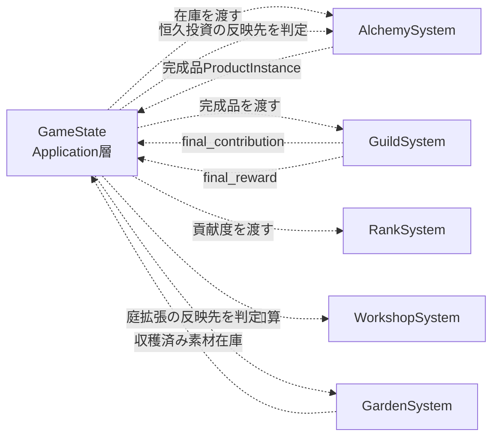

# コアシステム設計

作成日: 2026-08-04
準拠要件: [`../../spec/atelier-alchemy-core/requirements.md`](../../spec/atelier-alchemy-core/requirements.md)（以下「要件定義書」）

## システム一覧

| システム名 | 責務 | 依存システム |
|-----------|------|-------------|
| GardenSystem（庭） | 種植え・生育進行・収穫・特性付与 | なし（Domain層の他システムを直接参照しない） |
| AlchemySystem（調合） | 投入枠管理・品質計算・特性発現・調合実行 | なし |
| GuildSystem（ギルド納品） | 納品の自動決算・指定合致判定 | なし |
| WorkshopSystem（工房強化・ショップ） | 恒久投資/消耗投資の購入可否判定・適用 | なし |
| RankSystem（ランク進行・昇格試験） | ランクHP・制限ターン・降格カウンタ・昇格試験の管理 | なし |

🔵 5システムの区分は `CLAUDE.md`（庭/調合/ギルド納品/工房強化/ランク進行の5機能）に基づく確定事項。

🔵 **2026-08-05修正（PRレビューWarning対応）**: 旧版は「GuildSystemはRankSystemに依存、RankSystemはGuildSystemに依存」という相互依存を表に記載しており、「システム間相互作用まとめ」の図とあわせて循環依存になっていた。実際の呼び出し順序（[`dataflow.md`](./dataflow.md) 参照）はいずれも Application層（`GameState`）が各Domain層の純粋関数を順番に呼び出す構成であり、**Domain層のシステム同士が互いを参照することはない**。依存関係は「システム間相互作用まとめ」の図が示す通り、`GameState`を介した一方向のデータの受け渡しとして表現する。

---

## GardenSystem（庭）詳細設計

### 責務

要件定義書 §3「庭（仕込み層）」・§4「素材（Material）」に基づき、種植え・生育の進行・収穫・特性付与を担う。

### クラス図

### 主要メソッド

| メソッド名 | 引数 | 戻り値 | 説明 |
|-----------|------|--------|------|
| `Planting.plant` | `garden_state: GardenState, seed_id: StringName, master: SeedMaster` | `Result`（成功/失敗） | 空きスロットがあれば種を植える。スロット数上限は `GameBalance.GARDEN_SLOT_COUNT`（🟡TBD、要件定義書§7） |
| `Harvest.advance_growth` | `plant_state: PlantState, turns: int` | `PlantState` | ターン経過分だけ生育を進める（新オブジェクトを返す、副作用なし） |
| `Harvest.resolve_withering` | `garden_state: GardenState, masters: Dictionary[StringName, SeedMaster]` | `GardenState` | `is_dead`が真の株を`garden_state.plants`から除去してスロットを解放した新しい`GardenState`を返す（🔵2026-08-05追加、PRレビューCritical#11対応。ターン終了処理で`advance_growth`の直後に必ず呼ぶ） |
| `Harvest.is_matured` | `plant_state, master: SeedMaster` | `bool` | `plant_state.grown_turns >= master.maturity_turns` を判定。`maturity_turns` は種別ごとに異なる（🟡TBD、要件定義書§7「素材種別ごとの成熟ターン数」） |
| `Harvest.is_dead` | `plant_state, master: SeedMaster` | `bool` | 成熟後 `master.death_grace_turns`（🟡TBD、要件定義書§7「枯死猶予ターン数」）を超えて未収穫なら真 |
| `Harvest.harvest` | `plant_state, rng_roll_quality: float, rng_roll_trait: float` | `Result`（成功時`MaterialInstance`／失敗時 枯死理由） | 品質を確定し `TraitRoll` で特性を1つ付与して収穫する。`is_dead`が真の株を収穫しようとした場合は失敗を返す。戻り値を`Planting.plant`と同じ`Result`型に揃えた（🔵2026-08-05修正、PRレビューQA-W10対応。旧版は戻り値が`MaterialInstance`固定で異常系の表現がなかった） |
| `TraitRoll.roll_trait` | `seed_master: SeedMaster, rng_value: float` | `StringName` | 種の`trait_pool`（種ごとに紐づく特性候補配列）から一様乱数で1つ選択する |

### 品質確定ロジックの方針（🟡本文書での設計）

コンセプト文書 `atelier-concept.md` §5「庭（仕込み層）の仕組み」の「今Bで抜くか、S狙いで1ターン賭けるか」（🔵2026-08-05修正: 旧版は誤って「要件定義書」からの引用としていたが、この文言の実体は`atelier-concept.md`側にありrequirements.mdには存在しない。PRレビューLogic/Naming/QA各観点で指摘された行番号誤引用の一例として修正した）は、待機によって品質が**確率的に**上昇する設計であることを示唆する（「賭け」という表現）。以下の方針を提案する。

- 成熟直後に収穫すると品質は `master.base_quality`（種ごとの基準品質、🟡TBD）で確定する
- 成熟後さらに待機すると、待機1ターンごとに `GameBalance.QUALITY_UP_CHANCE`（🟡TBD）の確率で品質が1段階上昇する（上限S）
- 枯死猶予ターンを超えると素材は全損（`Harvest.harvest`が失敗を返す）
- この上昇判定用の乱数と、`TraitRoll`の特性選択用の乱数は別個の乱数列として扱う（要件定義書§4「素材（Material）」の「乱数は分散のみで期待値は動かさない」は特性選択にのみ言及しており、品質上昇ロジックとは独立した規定であるため）。`Harvest.harvest`の引数を`rng_roll_quality`/`rng_roll_trait`の2値に分け、呼び出し元（`GameState`）が`RngService`から2回払い出して渡す（🔵2026-08-05修正、PRレビューArchitecture-W04/Error Handling-W09対応。旧版は引数が1つしかなく、2つ目の乱数値がDomain層内部で自己生成される読み取りが可能で純粋性原則に反していた）

🔴 品質確率上昇の具体式（上昇確率、上限有無）は要件定義書に数値の記載がなく、本文書での推測である。バランス調整フェーズで要検証。

### RNG管理

`TraitRoll.roll_trait` および品質上昇判定はいずれも `RngService` Autoloadが払い出す乱数値を引数として受け取る（Domain層は`RandomNumberGenerator`を直接保持しない。[`architecture.md`](./architecture.md) のレイヤー依存ルールに従う）。

---

## AlchemySystem（調合）詳細設計 ★ゲームの核心

### 責務

要件定義書 §3「調合（主戦場）」・§4「調合物」「調合台」に基づき、投入枠管理・品質計算・特性発現判定・調合実行を担う。

### クラス図

### 主要メソッド

| メソッド名 | 引数 | 戻り値 | 説明 |
|-----------|------|--------|------|
| `QualityCalculator.calculate_quality` | `materials: Array[MaterialInstance]` | `int`（1〜5、D〜S） | 投入素材の品質スコアの平均を四捨五入する（🔵要件定義書§4「調合物（Product）」に確定済み）。**投入素材中に「触媒」タグを持つ素材が1つでもあれば、四捨五入後の値に+1し、上限5でクランプする**（🔵2026-08-05修正、PRレビューCritical#6対応。触媒の効果適用位置を「素材自身の品質」から「平均・四捨五入後の最終品質」に変更した。旧仕様は平均計算で効果がほぼ相殺され消えてしまう欠陥があった。要件定義書§4「特性タグ（Trait）」参照） |
| `QualityCalculator.quality_multiplier` | `quality_score: int` | `float` | 品質スコア（1〜5）に対する単調非減少の乗数を返す。数値テーブルは🟡TBD（要件定義書§5「数値設計」参照） |
| `TraitActivation.count_trait_occurrences` | `materials, trait_tag: StringName` | `int` | 投入素材中の特定特性タグの出現数を数える（触媒タグはこの関数の対象外。`QualityCalculator`側で個別処理する） |
| `TraitActivation.resolve_traits` | `materials: Array[MaterialInstance]` | `Array[StringName]` | 出現数2個以上の特性タグのみ発現済みとして返す（🔵要件定義書§4「特性タグ（Trait）」の「同一特性タグの素材を2個以上投入すると発現、1個のみでは不発」「3個目以降を追加投入してもボーナスは据え置き」＝2個以上は全てブール発現、加算されない） |
| `SlotState.can_execute` | なし | `bool` | `selected_recipe_id != &"" and 1 <= materials.size() and materials.size() <= max_slots` を返す（🔵2026-08-05修正、PRレビューWarning#7対応。旧版は下限1個のみを見ており上限`max_slots`の検証が抜けていた。要件定義書§3/§4「0個投入では実行不可」「枠数を超えて同時投入できない」の両方に対応） |
| `ProductValueCalculator.calculate_contribution` | `base_contribution, quality_mult, trait_bonus` | `float` | `基礎貢献度 × 品質倍率 × 貢献度系特性ボーナス`（指定合致ボーナスを含まない、後述）。`base_contribution`は`SlotState.selected_recipe_id`が指す`RecipeMaster`から取得する（🔵2026-08-04ヒアリングで事前選択方式に確定、[`data-schema.md`](./data-schema.md) RecipeMaster節参照） |
| `ProductValueCalculator.calculate_reward` | `base_reward, quality_mult, trait_bonus` | `float` | `基礎報酬 × 品質倍率 × 報酬系特性ボーナス`（指定合致ボーナスを含まない、後述）。`base_reward`も同レシピから取得する |

🔴 **2026-08-05修正（PRレビューCritical#4対応）**: 旧版は`calculate_contribution`/`calculate_reward`が`order_match_bonus`（指定合致ボーナス）も引数に取っていたが、`dataflow.md`のシーケンスではこの呼び出し時点で合致判定（`DeliveryResolver.matches_order`）がまだ行われておらず、`GuildSystem.DeliveryResolver.resolve`側でも別途ボーナスを適用する設計になっていたため、実装すると二重に乗算されるバグになることが判明した。指定合致ボーナスの適用は`GuildSystem.DeliveryResolver`側に一本化し、`ProductValueCalculator`からは`order_match_bonus`引数を削除した（GuildSystem節参照）。

### レシピ選択（🔵2026-08-04ヒアリングで確定）

調合実行前に、プレイヤーは解禁済みレシピ（`GameState.player.permanent_upgrades.unlocked_recipe_ids`。**最低1件以上が保証される**、要件定義書§4「レシピ（Recipe）」参照）から1つを選び`SlotState.selected_recipe_id`にセットする（**事前選択方式**）。`selected_recipe_id`が未設定の場合は`SlotState.can_execute()`を偽とする（🟡本文書での追加提案。要件定義書に「レシピ未選択時に実行不可」の明記はないが、`base_contribution`/`base_reward`の参照先がないと計算が成立しないため必須とした）。

### 投入検証（🔵2026-08-05追加、PRレビューWarning#8対応）

`GameState.execute_alchemy`はDomain層の計算を呼ぶ前に、以下を**Application層で再検証**する（[`architecture.md`](./architecture.md)「検証責務のレイヤー配置原則」参照）。

- 渡された`instance_id`がすべて`GameState.inventory`に実在するか
- 同一`instance_id`が投入枠内で重複していないか（二重投入の禁止）

いずれかを満たさない場合は計算に進まず失敗を返す。UIの投入操作自体（在庫カードを選択不可表示にする等）は先出しフィードバックに過ぎず、正当性の最終担保はここで行う。

### 特性ボーナスの算出（🔵2026-08-04ヒアリングで確定）

`resolve_traits` が返す発現特性の集合から、貢献度系特性ボーナス・報酬系特性ボーナスを以下の方針で合成する。

- 発現した貢献度系特性（聖・浄・癒）ごとに個別の乗数（`GameBalance.TRAIT_CONTRIBUTION_BONUS[trait_tag]`、🟡TBD）を持ち、複数発現時は**乗算**で合成する（例: 聖と浄の両方が発現した場合、貢献度側は「聖の乗数×浄の乗数」を乗算する。聖〔貢献度系〕と金〔報酬系〕のように**異なる系統間では乗算しない**）
- 報酬系特性（金・華・稀）も同様
- 貢献度系特性は`calculate_reward`に、報酬系特性は`calculate_contribution`に影響しない（互いに干渉しない設計。要件定義書の式が「貢献度系特性ボーナス」「報酬系特性ボーナス」を別変数として分けていることと整合）
- 補助系特性「触媒」（品質+1段）は`TraitActivation`（発現閾値2個ルール）の対象外とし、`QualityCalculator.calculate_quality`側で個別処理する（上記メソッド表参照）。触媒素材自身の基準品質スコアは🟡TBD（要件定義書§4「特性タグ（Trait）」参照）

🟡 **将来のリファクタリング候補（PRレビューWarning、任意対応）**: 現状の設計は`GameState.execute_alchemy`が「実行可否判定→品質計算→特性発現→価値算出→納品判定→HP反映→在庫消費→ゴールド加算→signal発行」の一連の手続きを1メソッドで統括する構成になっている（[`dataflow.md`](./dataflow.md) 参照）。将来機能追加でこのメソッドが肥大化する場合は、「投入素材+レシピ→ProductInstance」を返す純粋関数（例: `features/alchemy/logic/alchemy_transaction.gd`）を切り出し、`GameState`は差分の適用とsignal発行のみに縮小することを検討する。現時点では実装前のため必須の変更とはしない。

---

## GuildSystem（ギルド納品）詳細設計

### 責務

要件定義書 §3「ギルド納品」・§4「日替わり指定調合物」に基づき、調合完了時の自動決算（プレイヤー操作なし）を担う。

### クラス図

### 主要メソッド

| メソッド名 | 引数 | 戻り値 | 説明 |
|-----------|------|--------|------|
| `DeliveryResolver.matches_order` | `product: ProductInstance, daily_order: DailyOrderMaster` | `bool` | 完成品が本日の指定条件（品目 or 特性傾向）に合致するか判定する。**`daily_order`が`null`の場合は必ず`false`を返す**（🔵2026-08-05修正、PRレビューCritical#9対応。昇格試験からは`daily_order`に`null`を渡す設計〔RankSystem節参照〕のため、nullガードをこのメソッドの契約として明記した） |
| `DeliveryResolver.resolve` | `product: ProductInstance, daily_order: DailyOrderMaster` | `DeliveryResult` | `matches_order`の結果に応じて指定合致ボーナス（🟡TBD倍率、要件定義書§5では仮1.2〜1.5倍）を適用し、最終貢献度/報酬を算出する。**指定合致ボーナスの適用はこの関数が一手に担う**（🔵2026-08-05修正、PRレビューCritical#4対応。`final_contribution = product.contribution × (order_matched ? bonus : 1.0)`、`final_reward`も同様。`ProductValueCalculator`側では合致ボーナスを掛けない） |

納品自体はプレイヤー操作なしで自動実行される（要件定義書§3「ギルド納品」）ため、`GuildSystem`にUI操作用のpublicメソッドは存在しない。`AlchemySystem`の調合実行と同一トランザクション内で呼び出される想定。

🟡 **プレビュー表示との整合**: [`ui-design/screens/alchemy.md`](./ui-design/overview.md)のライブプレビューも、実行時と同じ`ProductValueCalculator`→`DeliveryResolver`の経路を通して算出すること。プレビューが`ProductValueCalculator`の結果だけを表示すると指定合致ボーナス抜きの値になり、実際の納品結果と食い違う。

---

## WorkshopSystem（工房強化・ショップ）詳細設計

### 責務

要件定義書 §3「工房強化・ショップ」・§4に基づき、恒久投資（ランク間のみ）と消耗投資（ターン中いつでも）の購入可否判定と適用を担う。

### クラス図

### 主要メソッド

| メソッド名 | 引数 | 戻り値 | 説明 |
|-----------|------|--------|------|
| `PurchaseValidator.can_purchase` | `gold: int, price: int, already_purchased_count: int, max_purchase_count: int` | `bool` | `gold >= price and already_purchased_count < max_purchase_count` を返す（🔵要件定義書§3「工房強化・ショップ」「所持ゴールドが価格未満の場合は購入不可」）。`max_purchase_count`は恒久投資の重複購入を防ぐための上限（🔵2026-08-05追加、PRレビューWarning#対応。旧版はゴールド比較のみで、投入枠+1等の恒久投資を無制限に購入できてしまう不備があった。消耗投資は`max_purchase_count`に十分大きな値〔実質無制限〕を設定する） |
| `PurchaseValidator.is_permanent_upgrade` | `upgrade: UpgradeMaster` | `bool` | 恒久投資（投入枠+1／庭拡張／レシピ解禁）か消耗投資（触媒／種の指名買い）かを判別する。恒久投資はランク間の工房強化画面でのみ購入可能という制約は、UI側での抑止に加えて`GameState`側の購入適用メソッドでも再検証する（🔵要件定義書§3「工房強化・ショップ」、[`architecture.md`](./architecture.md)「検証責務のレイヤー配置原則」参照） |

購入適用（`GameState`のゴールド減算・恒久フラグ更新）は`GameState`側のメソッド（Application層）が、UIの判定結果を信頼せず`PurchaseValidator.can_purchase`を**再評価してから**実行する（🔵2026-08-05追加、PRレビューWarning#対応）。

---

## RankSystem（ランク進行・昇格試験）詳細設計

### 責務

要件定義書 §2「勝敗条件」・§4「ギルドランク（敵）」「昇格試験（Exam）」に基づき、ランクHP管理・制限ターン管理・降格カウンタ・昇格試験の管理を担う。**昇格試験は通常ターンループの調合・納品ロジック（`AlchemySystem`/`GuildSystem`）をそのまま再利用する**設計とする（🔵2026-08-04ヒアリングで確定。以前は骨子のみの設計だったが、本改訂で試験ロジック自体を確定した）。

### クラス図

### 主要メソッド

| メソッド名 | 引数 | 戻り値 | 説明 |
|-----------|------|--------|------|
| `RankHpResolver.apply_contribution` | `current_hp: float, contribution: float` | `float` | `max(0.0, current_hp - contribution)`（🔵要件定義書§4「ギルドランク（敵）」の「0未満にはならず0でクランプ。オーバーキル分は切り捨て」） |
| `RankHpResolver.is_rank_cleared` | `current_hp: float` | `bool` | `current_hp <= 0.0` |
| `RankHpResolver.reset_for_retry` | `rank_master: RankMaster` | `RankState` | `rank_hp = rank_master.max_hp`、`elapsed_turn = 0`で初期化した`RankState`を返す（🔵2026-08-05追加、PRレビューCritical#3対応。降格して同一ランクに再挑戦する際に呼ぶ。庭・在庫・ゴールド・恒久投資は引き継ぐためこの関数の対象外。要件定義書§2「降格時のリセット規定」参照） |
| `TurnLimitResolver.is_turn_limit_reached` | `current_turn, limit_turn: int` | `bool` | `current_turn >= limit_turn`（`limit_turn`は🟡TBD、要件定義書§7） |
| `TurnLimitResolver.resolve_rank_outcome` | `hp_cleared: bool, turn_limit_reached: bool` | `RankOutcome` | **制限ターン到達時にのみ**判定する（`turn_limit_reached`が偽なら常に`CONTINUE`）。到達時、HP0なら`PROMOTION_ELIGIBLE`、0でなければ`DEMOTION`を返す（🔵要件定義書§2「勝敗条件」。2026-08-05ヒアリングで「ランクHPが制限ターンより先に0になっても試験への移行は制限ターン到達まで待つ」ことを明記。それまでの残りターンは通常プレイを継続できる意図的な早期クリアボーナスとする） |
| `PromotionExamResolver.start_exam` | `rank_master: RankMaster` | `ExamState` | `exam_hp = exam_hp_max = (rank_master.max_hp / rank_master.limit_turn) * rank_master.exam_turn_limit * rank_master.exam_difficulty_coefficient`（🔵2026-08-05修正、PRレビューCritical#5対応。旧式`max_hp × 倍率`は試験制限ターンが1〜2ターンしかないため要求貢献度が通常ランクの約20倍になり成立しなかった。新式は「当該ランクの1手あたり期待貢献度 × 試験制限ターン数 × 難度係数」で、係数`exam_difficulty_coefficient`のみ🟡TBD）、`exam_turn_limit = rank_master.exam_turn_limit`（🟡TBD、仮1〜2ターン）で初期化する |
| `PromotionExamResolver.advance_turn` | `exam_state: ExamState` | `ExamState` | `exam_elapsed_turn`を+1した新しい`ExamState`を返す（🔵2026-08-05追加、PRレビューCritical#10対応。調合を実行せずにターンだけ進める操作用。在庫や解禁レシピが尽きて調合できない場合の脱出手段として、UI側に「ターンを進める」ボタンを用意する。[`ui-design/screens/promotion-exam.md`](./ui-design/screens/promotion-exam.md) 参照） |
| `PromotionExamResolver.resolve_outcome` | `exam_state: ExamState` | `ExamOutcome` | `exam_hp <= 0` なら`SUCCESS`。`exam_elapsed_turn >= exam_turn_limit` かつ `exam_hp > 0` なら`FAILURE`。それ以外は`CONTINUE`（試験続行）。`advance_turn`のみでもこの判定に到達できる |

### 昇格試験の詳細設計（🔵2026-08-04ヒアリングで確定）

昇格試験は「通常のギルドランクループを、庭なし・専用HP・超短期ターンに圧縮した一発勝負」として設計する。新規のゲームメカニクスを発明せず、既存の`AlchemySystem`（レシピ選択・投入枠・品質計算・特性発現）と`GuildSystem`（納品決算）をそのまま呼び出す。

- **発生条件**: `TurnLimitResolver.resolve_rank_outcome` が `PROMOTION_ELIGIBLE` を返した時点（制限ターン到達時点でランクHPが0の場合のみ。§2「勝敗条件」参照）で、通常ターンループから離脱し `PromotionExamScene` へ遷移し、`PromotionExamResolver.start_exam` で`ExamState`を生成する（[`dataflow.md`](./dataflow.md) 参照）
- **庭は使用不可**: 試験中は`GardenSystem`を呼び出さない（新規の種植え・収穫ができない）。プレイヤーはランク到達時点までに貯めた在庫のみで挑む（🔵要件定義書§3「昇格試験」参照）
- **調合・納品は通常と同一操作**: `AlchemySystem`のレシピ選択→投入枠→`SlotState.can_execute()`→`QualityCalculator`→`TraitActivation`→`ProductValueCalculator`→`DeliveryResolver`の流れをそのまま呼び出す
- **日替わり指定調合物ボーナスは適用しない**: `GuildSystem.DeliveryResolver.resolve`を呼ぶ際、`daily_order`に`null`を渡す。`matches_order`は`null`を渡された場合`false`を返す契約になっている（🔵GuildSystem節「主要メソッド」参照）
- **報酬（ゴールド）は通常どおり獲得する**: `DeliveryResolver.resolve`が返す`final_reward`は試験中も通常どおり`GameState.player.gold`に加算する（🔵2026-08-05ヒアリングで確定。指定合致ボーナスのみ試験中は常に不適用になるが、報酬系特性のボーナス自体は`ProductValueCalculator.calculate_reward`の時点で通常どおり計算される）
- **試験HPへの反映**: `DeliveryResolver.resolve`から得られた`final_contribution`を、通常の`RankHpResolver.apply_contribution`と同じクランプロジック（`max(0, hp - contribution)`）で`ExamState.exam_hp`に適用する。実装上は`RankHpResolver.apply_contribution`をそのまま呼び出せる（HPの入れ物が`RankState`か`ExamState`かの違いのみ）
- **ターン進行**: 調合を実行した場合はその処理の一部として、実行しなかった場合は`PromotionExamResolver.advance_turn`の呼び出しによって`exam_elapsed_turn`を+1する。**「ターンを進める」操作は調合実行なしでも常に選択できる**（🔵2026-08-05修正、PRレビューCritical#10対応。旧版は調合実行時にしかターンが進まず、在庫や解禁レシピが尽きた状態で試験に入るとデッドロックした）
- **結果の扱い**:
  - `ExamOutcome.SUCCESS` → 次ランクへ昇格し、`WorkshopScreen`（恒久投資選択、購入は任意）へ遷移。降格回数カウンタ（`GameState.player.demotion_count`）を0にリセットする（🔵2026-08-05追加、PRレビューCritical#3対応）
  - `ExamOutcome.FAILURE` → 同ランクに留まって再挑戦（「降格」）。降格回数カウンタを+1し、規定回数（🟡TBD、仮3回）に達していればゲームオーバー。再挑戦するランクの状態は`RankHpResolver.reset_for_retry`でリセットする（🔵2026-08-05追加、PRレビューCritical#3対応）

---

## システム間相互作用まとめ

🔵 **2026-08-05修正（PRレビュー対応）**: 旧版は`GardenSystem`/`AlchemySystem`/`GuildSystem`/`RankSystem`/`WorkshopSystem`が互いを直接参照する図になっており、`Guild→Rank`と`Rank→Guild`（システム一覧表側）で循環依存が生じていた。実際にはこれらのDomain層システムは互いを一切参照せず、すべての受け渡しは`GameState`（Application層）が仲介する。上図はその仲介構造を明示したもの。

