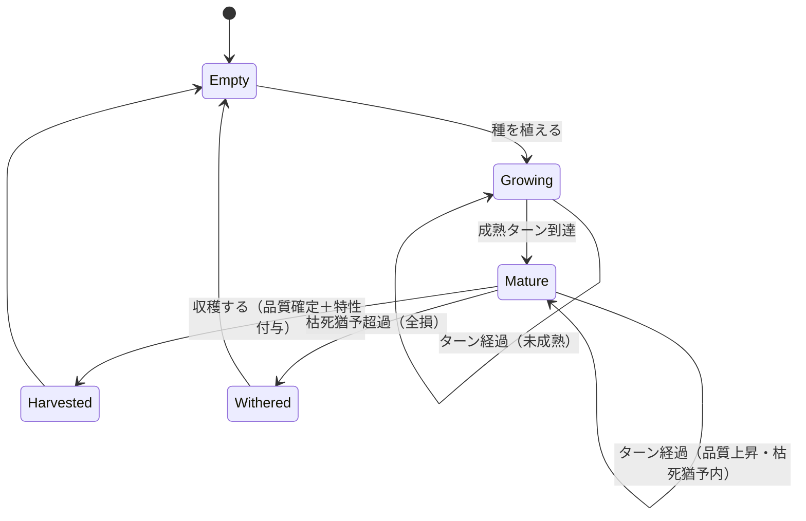
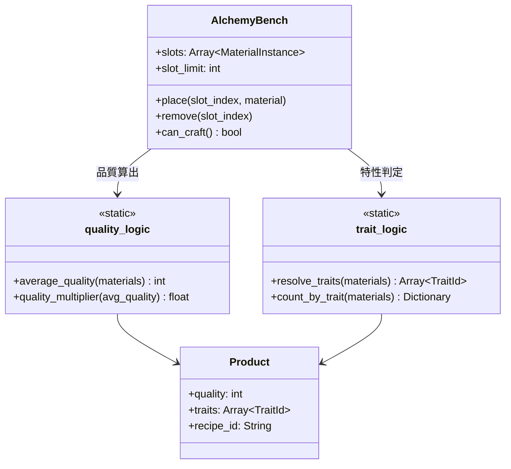
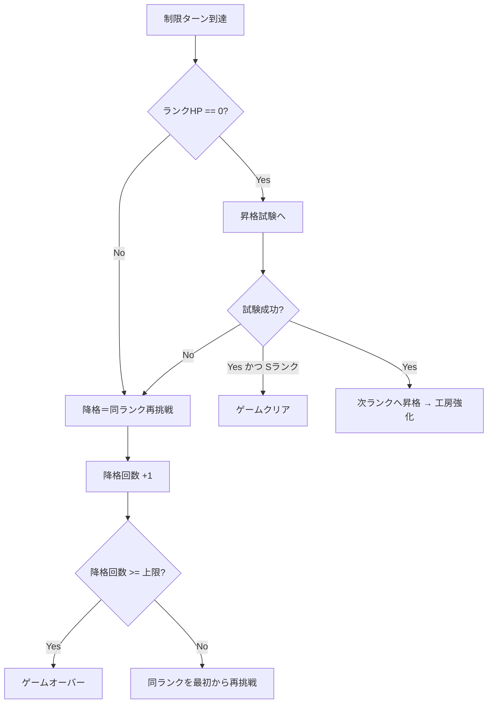
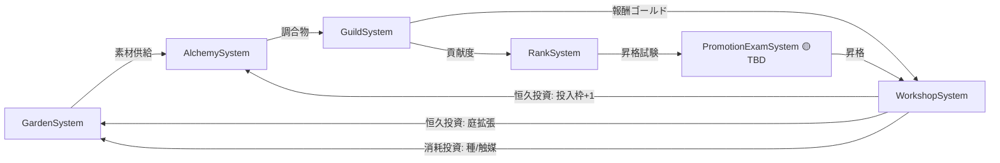

# コアシステム設計

準拠要件: [`../../spec/atelier-alchemy-core/requirements.md`](../../spec/atelier-alchemy-core/requirements.md)
関連: [`architecture.md`](architecture.md)

> **信頼性レベル凡例**: 🔵 要件/コンセプト準拠 ／ 🟡 妥当な推測 ／ 🔴 新規推測

---

## システム一覧

🔵 機能（Feature）単位のコアシステム。各システムは Domain層（純粋関数 `logic/`）と、それを駆動する Application層（`GameState`）に分かれる。

| システム名 | 責務 | 依存システム | 主な配置 |
|-----------|------|-------------|---------|
| GardenSystem（庭） | 種の植付・生育進行・収穫品質確定・特性付与・枯死判定 | RngService, MasterData | `features/garden/logic/garden_logic.gd` |
| AlchemySystem（調合） | 投入枠管理・品質計算・特性発現判定・調合物生成 | MasterData | `features/alchemy/logic/quality_logic.gd`, `trait_logic.gd` |
| GuildSystem（納品） | 貢献度・報酬算出・指定合致判定・自動納品決算 | AlchemySystem, RankSystem | `features/guild/logic/contribution_reward_logic.gd` |
| RankSystem（ランク進行） | ランクHP減算・制限ターン判定・昇降格・クリア判定 | — | `features/rank/logic/rank_logic.gd` |
| WorkshopSystem（工房強化） | 恒久投資・消耗投資の購入可否・効果適用 | GameState | `features/workshop/logic/shop_logic.gd` |
| PromotionExamSystem（昇格試験） | 一発勝負の特殊局面（🟡 TBD 別途設計） | RankSystem | `features/rank/logic/`（未定） |

---

## GardenSystem（庭・仕込み層）

### 責務

🔵 手持ちの種を庭スロットに植え、ターン経過で生育を進め、プレイヤーの収穫操作で品質を確定し、収穫時に特性を1つ乱数付与する。成熟後放置で品質が上がるが規定ターン超過で枯死（全損）。マス配置は無く、スロット数のみの制限。

### 状態遷移（1つの植付スロット）

### 主要関数（`garden_logic.gd`・純粋関数）

| 関数 | 引数 | 戻り値 | 説明 |
|------|------|--------|------|
| `advance_growth` | `plots: Array`, `elapsed: int` | `Array`（更新後スロット） | 全スロットの生育をターン分進め、枯死判定を反映 🔵 |
| `resolve_harvest_quality` | `plot`, `roll: float` | `int`（1〜5） | 成熟後の経過ターンと乱数から収穫品質（D〜S）を確定 🟡 |
| `roll_trait` | `seed: SeedMaster`, `roll: float` | `TraitId` or `null` | 種の狙い特性テーブルと分散乱数から付与特性を1つ決定（期待値不動）🔵 |
| `is_withered` | `plot`, `current_turn: int` | `bool` | 枯死猶予ターン超過判定 🔵 |
| `can_plant` | `plots: Array`, `slot_limit: int` | `bool` | 空きスロット有無の判定 🔵 |

> 🔵 乱数 `roll` は `RngService` が生成して引数で渡す。`garden_logic.gd` 自身は乱数を生成しない（Functional Core原則）。

---

## AlchemySystem（調合・主戦場★核心）

### 責務

🔵 在庫素材を投入枠（初期4・恒久投資で最大5）に配置し、投入素材の平均品質から調合物品質を算出、同一特性タグ2個以上で特性を発現させ、調合物を生成する。最低1個投入で実行可能、0個では実行不可。

### クラス図（概念）

### 主要関数

| 関数 | 引数 | 戻り値 | 説明 |
|------|------|--------|------|
| `average_quality` | `materials: Array` | `int`（1〜5） | 投入素材の平均品質。旧Phaser版 `calculateQuality` の**仕様**をGDScript再実装 🔵 |
| `quality_multiplier` | `avg_quality: int` | `float` | 品質倍率。旧Phaser版 `calculateAverageQualityMultiplier` の**仕様**を再実装 🔵 |
| `count_by_trait` | `materials: Array` | `Dictionary`（TraitId→個数） | 投入素材の特性タグを集計 🔵 |
| `resolve_traits` | `materials: Array` | `Array`（TraitId） | 同一タグ2個以上のものだけ発現（3個目以降据置）🔵 |
| `can_craft` | `slots: Array` | `bool` | 最低1個投入されているか 🔵 |
| `craft` | `slots`, `recipe` | `Product` | 品質・特性を確定した調合物を生成 🟡 |

> 🔵 「同一特性タグ2個以上で発現・3個目以降は追加強化なし」は確定仕様（[`requirements.md`](../../spec/atelier-alchemy-core/requirements.md) 4章・特性発現閾値=2個）。

---

## GuildSystem（ギルド納品・決算）

### 責務

🔵 調合実行後、完成品を自動でギルドへ納品し、貢献度（ランクHP減算）と報酬（ゴールド）を算出する。日替わり指定調合物に合致すればボーナスを乗せる。プレイヤー操作は結果確認のみ。

### 主要関数（`contribution_reward_logic.gd`）

| 関数 | 引数 | 戻り値 | 説明 |
|------|------|--------|------|
| `calc_contribution` | `product`, `spec`, `balance` | `int` | `基礎貢献度 × 品質倍率 × 貢献度系特性ボーナス × 指定合致ボーナス` 🔵 |
| `calc_reward` | `product`, `spec`, `balance` | `int` | `基礎報酬 × 品質倍率 × 報酬系特性ボーナス × 指定合致ボーナス` 🔵 |
| `is_spec_matched` | `product`, `daily_spec` | `bool` | 本日の指定調合物（品目 or 特性傾向）に合致するか 🔵 |
| `trait_bonus` | `traits`, `kind`, `balance` | `float` | 貢献度系/報酬系それぞれの特性ボーナス倍率を返す 🟡 |

> 🔵 計算式は [`requirements.md`](../../spec/atelier-alchemy-core/requirements.md) 4章「調合物・価値計算」に準拠。各基礎値・倍率は🟡 TBD（[`balance-design.md`](balance-design.md)）。

---

## RankSystem（ランク進行）

### 責務

🔵 納品による貢献度でランクHPを減算（0クランプ・オーバーキル切捨）、制限ターン到達時にHPが0なら昇格試験へ、0でなければ降格（同ランク再挑戦）。降格回数が上限到達でゲームオーバー、Sランク試験クリアでゲームクリア。

### 主要関数（`rank_logic.gd`）

| 関数 | 引数 | 戻り値 | 説明 |
|------|------|--------|------|
| `apply_contribution` | `hp: int`, `contribution: int` | `int` | HP減算（`max(0, hp - contribution)`）🔵 |
| `evaluate_turn_end` | `hp: int`, `remaining_turns: int` | `RankOutcome` | 継続 / 昇格試験へ / 降格 のいずれかを返す 🔵 |
| `next_rank` | `rank: GuildRank` | `GuildRank` | 昇格先ランク。Sならクリア扱い 🔵 |
| `is_game_over` | `demotion_count: int`, `limit: int` | `bool` | 降格回数が上限到達か 🔵 |

### ランクHPと結末の判定（制限ターン到達時）

---

## WorkshopSystem（工房強化・ショップ）

### 責務

🔵 報酬（ゴールド）を消費して恒久投資（ランクをまたいで残る：投入枠+1／庭拡張／レシピ解禁）と消耗投資（触媒／種の指名買い）を購入する。所持ゴールドが価格未満なら購入不可。恒久投資はランク間の工房強化画面でのみ、消耗投資はターン中いつでも。

### 主要関数（`shop_logic.gd`）

| 関数 | 引数 | 戻り値 | 説明 |
|------|------|--------|------|
| `can_purchase` | `gold: int`, `price: int` | `bool` | `gold >= price` 🔵 |
| `apply_permanent` | `state`, `upgrade_id` | `state`（差分） | 投入枠+1／庭スロット+／レシピ解禁を適用 🟡 |
| `price_of` | `item_id`, `balance` | `int` | 価格序列に基づく価格取得 🔵 |

> 🔵 価格序列 `投入枠+1 ≫ 庭拡張 ≒ レシピ解禁 ＞ 触媒 ＞ 種の指名買い`（[`requirements.md`](../../spec/atelier-alchemy-core/requirements.md) 4章）。金でターン延長する手段は意図的に無し。

---

## PromotionExamSystem（昇格試験）

🟡 **TBD（別途設計が必要）**。通常ターンループとは別の一発勝負の特殊局面（ボス戦的な専用画面・専用ルール）。成功で昇格＋工房強化、失敗で降格。具体的なルール・演出・敗北条件は本設計のスコープ外（[`requirements.md`](../../spec/atelier-alchemy-core/requirements.md) 2章・7章）。

本設計では以下のインターフェース境界のみ定義し、内部ルールは後続設計に委ねる。

- 入力: 現在ランク・プレイヤー状態（在庫・恒久投資）
- 出力: `ExamResult { success: bool }`
- `success == true` → `RankSystem.next_rank` → WorkshopUpgradeScene
- `success == false` → 降格処理（降格回数+1）

---

## システム間依存関係

🔵 庭→調合→納品の三段が別軸の判断で連結し、報酬は工房強化を通じて庭・調合の生産効率に還流する（複利ループ）。
