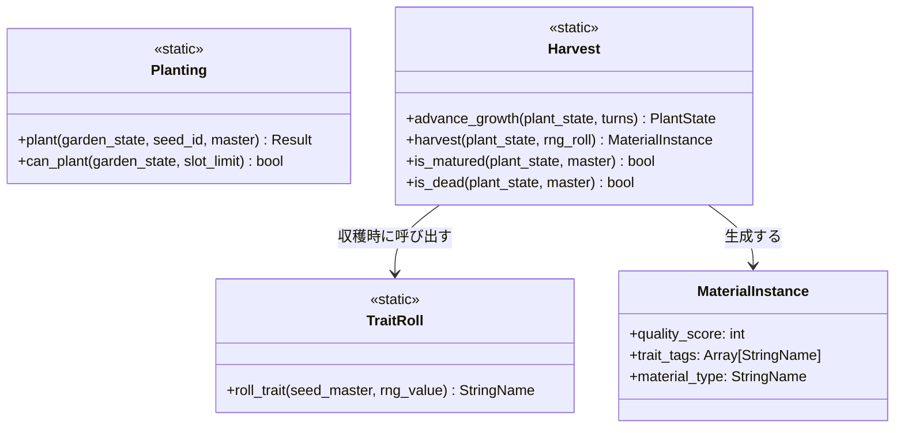
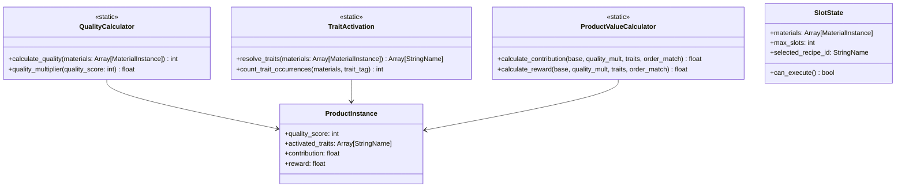
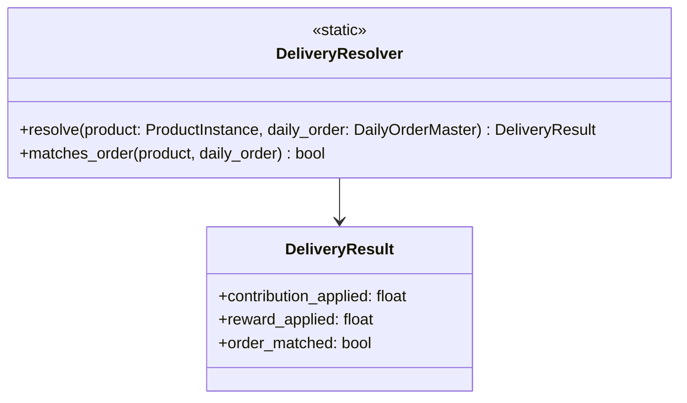
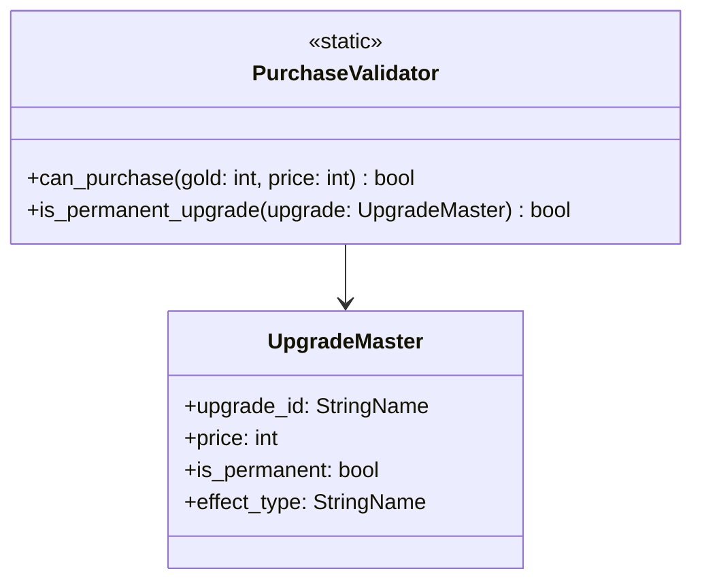
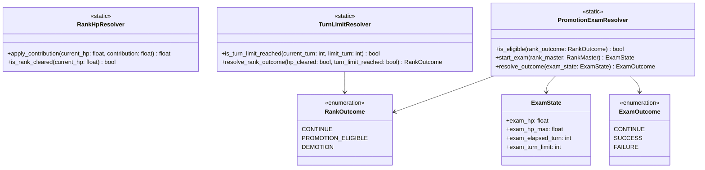
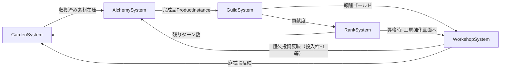

# コアシステム設計

作成日: 2026-08-04
準拠要件: [`../../spec/atelier-alchemy-core/requirements.md`](../../spec/atelier-alchemy-core/requirements.md)（以下「要件定義書」）

## システム一覧

| システム名 | 責務 | 依存システム |
|-----------|------|-------------|
| GardenSystem（庭） | 種植え・生育進行・収穫・特性付与 | RankSystem（残りターン数の参照） |
| AlchemySystem（調合） | 投入枠管理・品質計算・特性発現・調合実行 | GardenSystem（収穫済み素材在庫） |
| GuildSystem（ギルド納品） | 納品の自動決算・指定合致判定・ランクHP減算依頼 | AlchemySystem（完成品）, RankSystem（HP減算） |
| WorkshopSystem（工房強化・ショップ） | 恒久投資/消耗投資の購入可否判定・適用 | GuildSystem（獲得ゴールド） |
| RankSystem（ランク進行・昇格試験） | ランクHP・制限ターン・降格カウンタ・昇格試験の管理 | GuildSystem（HP減算契機） |

🔵 5システムの区分は `CLAUDE.md`（庭/調合/ギルド納品/工房強化/ランク進行の5機能）に基づく確定事項。

---

## GardenSystem（庭）詳細設計

### 責務

要件定義書 §3「庭（仕込み層）」・§4「素材（Material）」に基づき、種植え・生育の進行・収穫・特性付与を担う。

### クラス図

### 主要メソッド

| メソッド名 | 引数 | 戻り値 | 説明 |
|-----------|------|--------|------|
| `Planting.plant` | `garden_state: GardenState, seed_id: StringName, master: SeedMaster` | `Result`（成功/失敗） | 空きスロットがあれば種を植える。スロット数上限は `GameBalance.GARDEN_SLOT_COUNT`（🟡TBD、要件定義書§7） |
| `Harvest.advance_growth` | `plant_state: PlantState, turns: int` | `PlantState` | ターン経過分だけ生育を進める（新オブジェクトを返す、副作用なし） |
| `Harvest.is_matured` | `plant_state, master: SeedMaster` | `bool` | `plant_state.grown_turns >= master.maturity_turns` を判定。`maturity_turns` は種別ごとに異なる（🟡TBD、要件定義書§7「素材種別ごとの成熟ターン数」） |
| `Harvest.is_dead` | `plant_state, master: SeedMaster` | `bool` | 成熟後 `master.death_grace_turns`（🟡TBD、要件定義書§7「枯死猶予ターン数」）を超えて未収穫なら真 |
| `Harvest.harvest` | `plant_state, rng_roll: float` | `MaterialInstance` | 品質を確定し `TraitRoll` で特性を1つ付与して収穫する |
| `TraitRoll.roll_trait` | `seed_master: SeedMaster, rng_value: float` | `StringName` | 種の`trait_pool`（種ごとに紐づく特性候補配列）から一様乱数で1つ選択する |

### 品質確定ロジックの方針（🟡本文書での設計）

要件定義書 L204「今Bで抜くか、S狙いで1ターン賭けるか」は、待機によって品質が**確率的に**上昇する設計であることを示唆する（「賭け」という表現）。以下の方針を提案する。

- 成熟直後に収穫すると品質は `master.base_quality`（種ごとの基準品質、🟡TBD）で確定する
- 成熟後さらに待機すると、待機1ターンごとに `GameBalance.QUALITY_UP_CHANCE`（🟡TBD）の確率で品質が1段階上昇する（上限S）
- 枯死猶予ターンを超えると素材は全損（`MaterialInstance`を生成せず失敗を返す）
- この上昇判定用の乱数と、`TraitRoll`の特性選択用の乱数は別個の乱数列として扱う（要件定義書L103「乱数は分散のみで期待値は動かさない」は特性選択にのみ言及しており、品質上昇ロジックとは独立した規定であるため）

🔴 品質確率上昇の具体式（上昇確率、上限有無）は要件定義書に数値の記載がなく、本文書での推測である。バランス調整フェーズで要検証。

### RNG管理

`TraitRoll.roll_trait` および品質上昇判定はいずれも `RngService` Autoloadが払い出す乱数値を引数として受け取る（Domain層は`RandomNumberGenerator`を直接保持しない。[`architecture.md`](./architecture.md) のレイヤー依存ルールに従う）。

---

## AlchemySystem（調合）詳細設計 ★ゲームの核心

### 責務

要件定義書 §3「調合（主戦場）」・§4「調合物」「調合台」に基づき、投入枠管理・品質計算・特性発現判定・調合実行を担う。

### クラス図

### 主要メソッド

| メソッド名 | 引数 | 戻り値 | 説明 |
|-----------|------|--------|------|
| `QualityCalculator.calculate_quality` | `materials: Array[MaterialInstance]` | `int`（1〜5、D〜S） | 投入素材の品質スコアの平均（要件定義書L115「投入素材の平均品質」）。旧Phaser版 `calculateQuality` の仕様を移植（🔵要件定義書L146に明記、コード直接移植ではなく仕様移植） |
| `QualityCalculator.quality_multiplier` | `quality_score: int` | `float` | 品質スコアから貢献度/報酬の乗数を返す。旧Phaser版 `calculateAverageQualityMultiplier` の仕様移植（🔵要件定義書L154に明記）。具体的な数値テーブルは🟡TBD |
| `TraitActivation.count_trait_occurrences` | `materials, trait_tag: StringName` | `int` | 投入素材中の特定特性タグの出現数を数える |
| `TraitActivation.resolve_traits` | `materials: Array[MaterialInstance]` | `Array[StringName]` | 出現数2個以上の特性タグのみ発現済みとして返す（🔵要件定義書L112「同一特性タグの素材を2個以上投入すると発現、1個のみでは不発」「3個目以降を追加投入してもボーナスは据え置き」＝2個以上は全てブール発現、加算されない） |
| `SlotState.can_execute` | なし | `bool` | `materials.size() >= 1` を返す（🔵要件定義書L75/L122「0個投入では実行不可」） |
| `ProductValueCalculator.calculate_contribution` | `base_contribution, quality_mult, trait_bonus, order_match_bonus` | `float` | `基礎貢献度 × 品質倍率 × 貢献度系特性ボーナス × 指定合致ボーナス`（🔵要件定義書L117の式そのまま）。`base_contribution`は`SlotState.selected_recipe_id`が指す`RecipeMaster`から取得する（🔵2026-08-04ヒアリングで事前選択方式に確定、[`data-schema.md`](./data-schema.md) RecipeMaster節参照） |
| `ProductValueCalculator.calculate_reward` | `base_reward, quality_mult, trait_bonus, order_match_bonus` | `float` | `基礎報酬 × 品質倍率 × 報酬系特性ボーナス × 指定合致ボーナス`（🔵要件定義書L118の式そのまま）。`base_reward`も同レシピから取得する |

### レシピ選択（🔵2026-08-04ヒアリングで確定）

調合実行前に、プレイヤーは解禁済みレシピ（`GameState.player.permanent_upgrades.unlocked_recipe_ids`）から1つを選び`SlotState.selected_recipe_id`にセットする（**事前選択方式**）。`selected_recipe_id`が未設定の場合は`SlotState.can_execute()`を偽とする（🟡本文書での追加提案。要件定義書に「レシピ未選択時に実行不可」の明記はないが、`base_contribution`/`base_reward`の参照先がないと計算が成立しないため必須とした）。

### 特性ボーナスの算出（🔵2026-08-04ヒアリングで確定）

`resolve_traits` が返す発現特性の集合から、貢献度系特性ボーナス・報酬系特性ボーナスを以下の方針で合成する。

- 発現した貢献度系特性（聖・浄・癒）ごとに個別の乗数（`GameBalance.TRAIT_CONTRIBUTION_BONUS[trait_tag]`、🟡TBD）を持ち、複数発現時は**乗算**で合成する（例: 聖×金が両方発現した場合、貢献度側は聖の乗数のみ、報酬側は金の乗数のみを乗算。異なる系統間では乗算しない）
- 報酬系特性（金・華・稀）も同様
- 貢献度系特性は`calculate_reward`に、報酬系特性は`calculate_contribution`に影響しない（互いに干渉しない設計。要件定義書の式が「貢献度系特性ボーナス」「報酬系特性ボーナス」を別変数として分けていることと整合）
- 補助系特性「触媒」（品質+1段）は`TraitActivation`（発現閾値2個ルール）の対象外とし、`QualityCalculator`側で個別処理する。触媒タグを持つ素材を**1個投入するだけで**その素材自身の`quality_score`に+1段の効果が及ぶ（🔵2026-08-04ヒアリングで確定、要件定義書§4「特性タグ（Trait）」参照）

---

## GuildSystem（ギルド納品）詳細設計

### 責務

要件定義書 §3「ギルド納品」・§4「日替わり指定調合物」に基づき、調合完了時の自動決算（プレイヤー操作なし）を担う。

### クラス図

### 主要メソッド

| メソッド名 | 引数 | 戻り値 | 説明 |
|-----------|------|--------|------|
| `DeliveryResolver.matches_order` | `product: ProductInstance, daily_order: DailyOrderMaster` | `bool` | 完成品が本日の指定条件（品目 or 特性傾向）に合致するか判定 |
| `DeliveryResolver.resolve` | `product, daily_order` | `DeliveryResult` | 合致していれば指定合致ボーナス（🟡TBD倍率、要件定義書L156では仮1.2〜1.5倍）を適用した最終貢献度/報酬を算出する |

納品自体はプレイヤー操作なしで自動実行される（要件定義書L78）ため、`GuildSystem`にUI操作用のpublicメソッドは存在しない。`AlchemySystem`の調合実行と同一トランザクション内で呼び出される想定。

---

## WorkshopSystem（工房強化・ショップ）詳細設計

### 責務

要件定義書 §3「工房強化・ショップ」・§4に基づき、恒久投資（ランク間のみ）と消耗投資（ターン中いつでも）の購入可否判定と適用を担う。

### クラス図

### 主要メソッド

| メソッド名 | 引数 | 戻り値 | 説明 |
|-----------|------|--------|------|
| `PurchaseValidator.can_purchase` | `gold: int, price: int` | `bool` | `gold >= price` を返す（🔵要件定義書L83/L136「所持ゴールドが価格未満の場合は購入不可」） |
| `PurchaseValidator.is_permanent_upgrade` | `upgrade: UpgradeMaster` | `bool` | 恒久投資（投入枠+1／庭拡張／レシピ解禁）か消耗投資（触媒／種の指名買い）かを判別する。恒久投資はランク間の工房強化画面でのみ購入可能というUI制約は`WorkshopScreen`側で強制する（🔵要件定義書L81「※ランク間の工房強化画面でのみ」） |

購入適用（`GameState`のゴールド減算・恒久フラグ更新）は`GameState`側のメソッド（Application層）が`PurchaseValidator`の判定結果を受けて実行する。

---

## RankSystem（ランク進行・昇格試験）詳細設計

### 責務

要件定義書 §2「勝敗条件」・§4「ギルドランク（敵）」「昇格試験（Exam）」に基づき、ランクHP管理・制限ターン管理・降格カウンタ・昇格試験の管理を担う。**昇格試験は通常ターンループの調合・納品ロジック（`AlchemySystem`/`GuildSystem`）をそのまま再利用する**設計とする（🔵2026-08-04ヒアリングで確定。以前は骨子のみの設計だったが、本改訂で試験ロジック自体を確定した）。

### クラス図

### 主要メソッド

| メソッド名 | 引数 | 戻り値 | 説明 |
|-----------|------|--------|------|
| `RankHpResolver.apply_contribution` | `current_hp: float, contribution: float` | `float` | `max(0.0, current_hp - contribution)`（🔵要件定義書L126「0未満にはならず0でクランプ。オーバーキル分は切り捨て」） |
| `RankHpResolver.is_rank_cleared` | `current_hp: float` | `bool` | `current_hp <= 0.0` |
| `TurnLimitResolver.is_turn_limit_reached` | `current_turn, limit_turn: int` | `bool` | `current_turn >= limit_turn`（`limit_turn`は🟡TBD、要件定義書§7） |
| `TurnLimitResolver.resolve_rank_outcome` | `hp_cleared: bool, turn_limit_reached: bool` | `RankOutcome` | 制限ターン到達時、HP0なら`PROMOTION_ELIGIBLE`、0でなければ`DEMOTION`を返す（🔵要件定義書L126）。制限ターン未到達なら`CONTINUE` |
| `PromotionExamResolver.start_exam` | `rank_master: RankMaster` | `ExamState` | `exam_hp = exam_hp_max = rank_master.max_hp * rank_master.exam_hp_multiplier`（🟡倍率TBD）、`exam_turn_limit = rank_master.exam_turn_limit`（🟡TBD、仮1〜2ターン）で初期化する |
| `PromotionExamResolver.resolve_outcome` | `exam_state: ExamState` | `ExamOutcome` | `exam_hp <= 0` なら`SUCCESS`。`exam_elapsed_turn >= exam_turn_limit` かつ `exam_hp > 0` なら`FAILURE`。それ以外は`CONTINUE`（試験続行） |

### 昇格試験の詳細設計（🔵2026-08-04ヒアリングで確定）

昇格試験は「通常のギルドランクループを、庭なし・専用HP・超短期ターンに圧縮した一発勝負」として設計する。新規のゲームメカニクスを発明せず、既存の`AlchemySystem`（レシピ選択・投入枠・品質計算・特性発現）と`GuildSystem`（納品決算）をそのまま呼び出す。

- **発生条件**: `TurnLimitResolver.resolve_rank_outcome` が `PROMOTION_ELIGIBLE` を返した時点で、通常ターンループから離脱し `PromotionExamScene` へ遷移し、`PromotionExamResolver.start_exam` で`ExamState`を生成する（[`dataflow.md`](./dataflow.md) 参照）
- **庭は使用不可**: 試験中は`GardenSystem`を呼び出さない（新規の種植え・収穫ができない）。プレイヤーはランク到達時点までに貯めた在庫のみで挑む（🔵要件定義書§3「昇格試験」参照）
- **調合・納品は通常と同一操作**: `AlchemySystem`のレシピ選択→投入枠→`SlotState.can_execute()`→`QualityCalculator`→`TraitActivation`→`ProductValueCalculator`の流れをそのまま呼び出す
- **日替わり指定調合物ボーナスは適用しない**: `GuildSystem.DeliveryResolver.resolve`を呼ぶ際、`daily_order`に`null`相当を渡し、`matches_order`が常に偽になるようにする（🔵2026-08-04ヒアリングで確定）
- **試験HPへの反映**: `AlchemySystem`から得られた`貢献度`を、通常の`RankHpResolver.apply_contribution`と同じクランプロジック（`max(0, hp - contribution)`）で`ExamState.exam_hp`に適用する。実装上は`RankHpResolver.apply_contribution`をそのまま呼び出せる（HPの入れ物が`RankState`か`ExamState`かの違いのみ）
- **ターン進行**: 試験中に調合を実行してもしなくても、1回の行動で`exam_elapsed_turn`を+1する（🟡本文書での提案。通常ターンのような「庭の生育待ち」の概念がないため、試験は「行動→即座に次ターン判定」のテンポになる想定）
- **結果の扱い**:
  - `ExamOutcome.SUCCESS` → 次ランクへ昇格し、`WorkshopScreen`（恒久投資選択、購入は任意）へ遷移
  - `ExamOutcome.FAILURE` → 同ランクに留まって再挑戦（「降格」）。降格回数カウンタ（`GameState.player.demotion_count`）を+1し、規定回数（🟡TBD、仮3回）に達していればゲームオーバー

🟡 「1回の行動で即ターン経過」とするテンポの解釈は本文書での提案（要件定義書は超短期という方向性のみ確定し、ターン経過の具体的なトリガーまでは規定していない）。実装時に体験として硬すぎる場合は「調合を実行した回数」ではなく「プレイヤーが明示的にターンを終了した回数」を基準にする代替案もあるため、プロトタイプで検証すること。

---

## システム間相互作用まとめ

🔵 依存の向きはシステム一覧表と整合。循環依存は発生していない（`Workshop→Alchemy/Garden`は「反映」であり、`Alchemy/Garden→Workshop`への逆参照は発生しない設計）。
