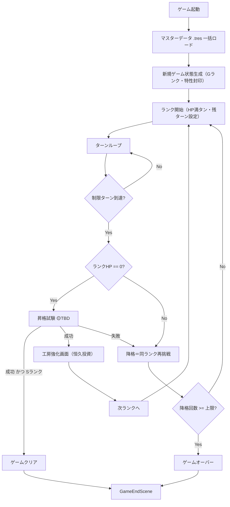
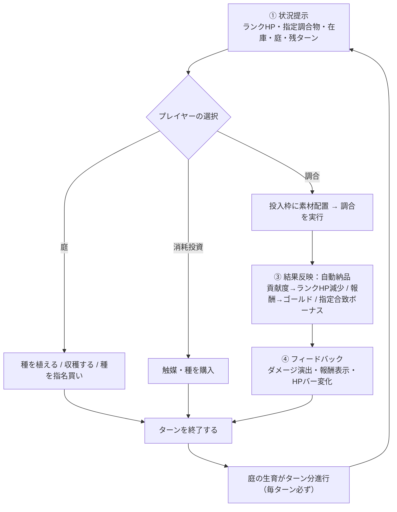
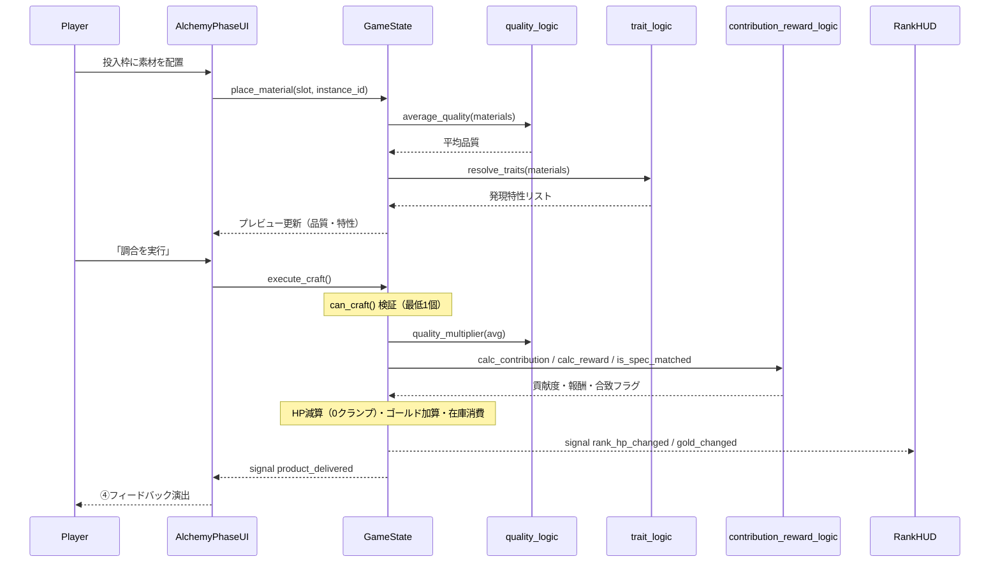
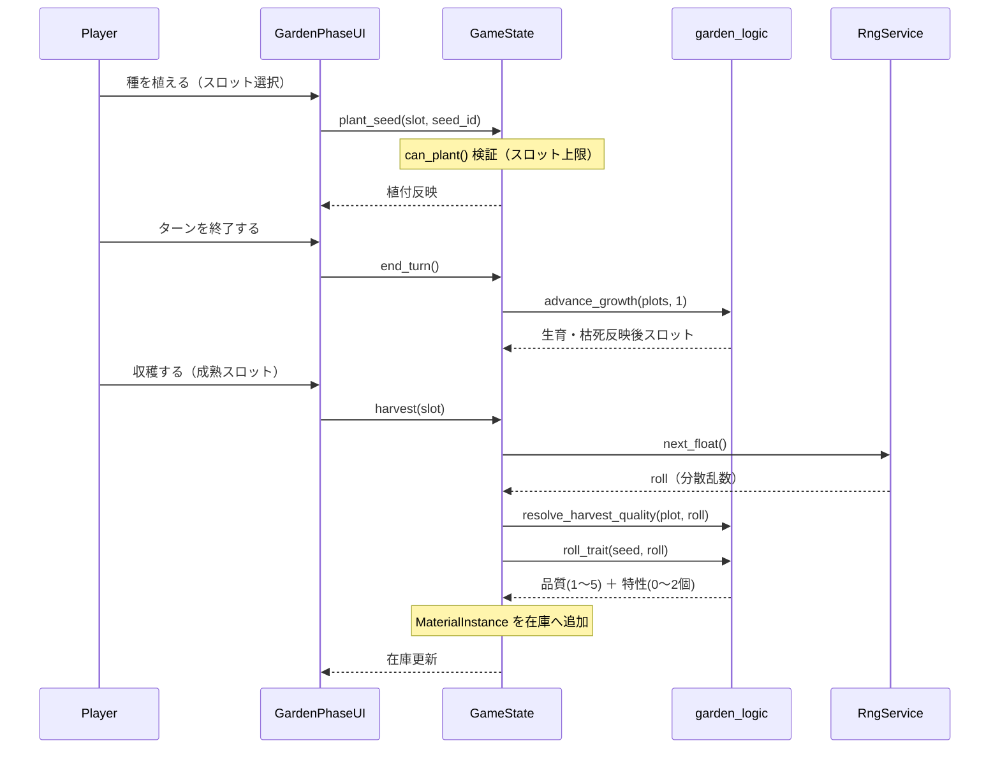
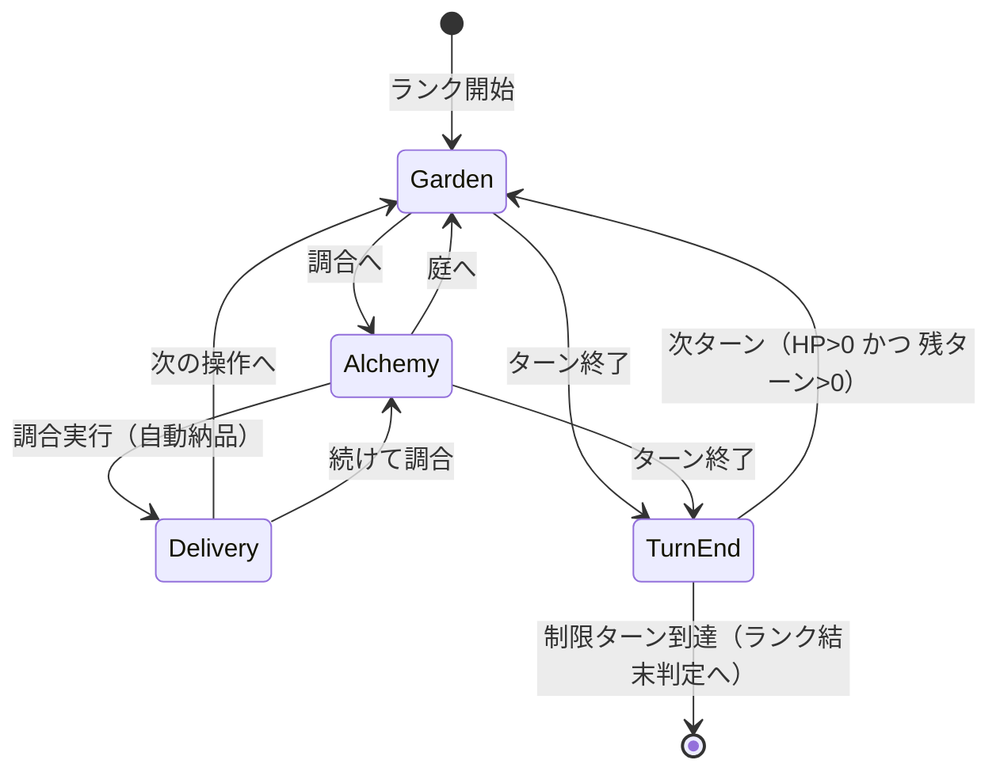
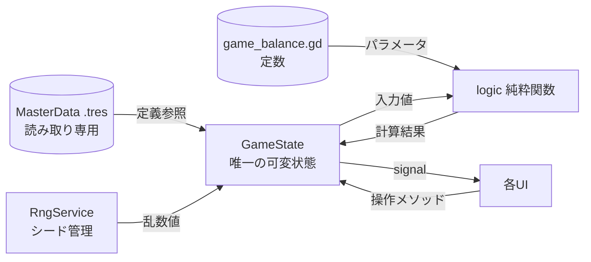

# データフロー図

準拠要件: [`../../spec/atelier-alchemy-core/requirements.md`](../../spec/atelier-alchemy-core/requirements.md)
関連: [`architecture.md`](architecture.md) / [`core-systems.md`](core-systems.md)

> **信頼性レベル凡例**: 🔵 要件/コンセプト準拠 ／ 🟡 妥当な推測 ／ 🔴 新規推測

---

## ゲーム全体のフロー

🔵 セーブ/ロードはスコープ外のため、起動時は常に新規ゲーム状態を生成する。

---

## ターンループのフロー（1ターン）

🔵 [`requirements.md`](../../spec/atelier-alchemy-core/requirements.md) 1章のプレイサイクルに準拠。主戦場は②調合。

> 🔵 庭の生育は「調合を実行したかどうかに関わらず、ターン終了で毎ターン必ず」進行する（[`requirements.md`](../../spec/atelier-alchemy-core/requirements.md) 1章③）。

---

## 調合〜納品のシーケンス（★核心）

🔵 UI（Presentation）→ GameState（Application）→ logic（Domain）→ signal でのUI更新、という往復。

---

## 庭の仕込み〜収穫のシーケンス

> 🔵 収穫時の特性付与は「分散のみ・期待値不動」の乱数（[`requirements.md`](../../spec/atelier-alchemy-core/requirements.md) 4章、`atelier-concept.md` L205）。乱数は `RngService` が供給し、`garden_logic` は純粋関数のまま。

---

## 状態遷移図（ゲームフェーズ）

🟡 庭/調合/納品はシーンではなくメインゲームシーン内のフェーズUI表示切替。フェーズは自由に行き来でき（v7.0は固定順序の依頼フローを廃止）、ターン終了で次ターンへ。

---

## データの所有と流れ

🔵 唯一の可変状態は `GameState`。Domain（`logic/`）は状態を持たず入出力のみ。Infrastructure（`.tres`）は読み取り専用。

| データ種別 | 所有者 | 可変性 | ロードタイミング |
|-----------|--------|--------|-----------------|
| マスターデータ（素材・レシピ・特性） | `.tres`（Infrastructure） | 不変 | BootScene起動時に一括 🔵 |
| バランス定数 | `game_balance.gd` | 不変（コード定義） | 起動時 🔵 |
| ゲーム進行状態 | `GameState`（Autoload） | 可変 | 新規ゲーム時に生成 🔵 |
| 素材インスタンス（収穫物・在庫） | `GameState` 内 | 可変 | 収穫・購入で生成 🟡 |
| セーブデータ | — | — | **スコープ外**（未実装）🔵 |
