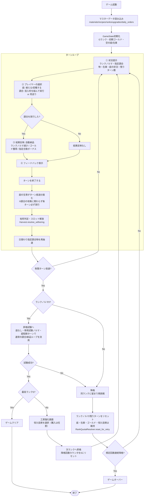
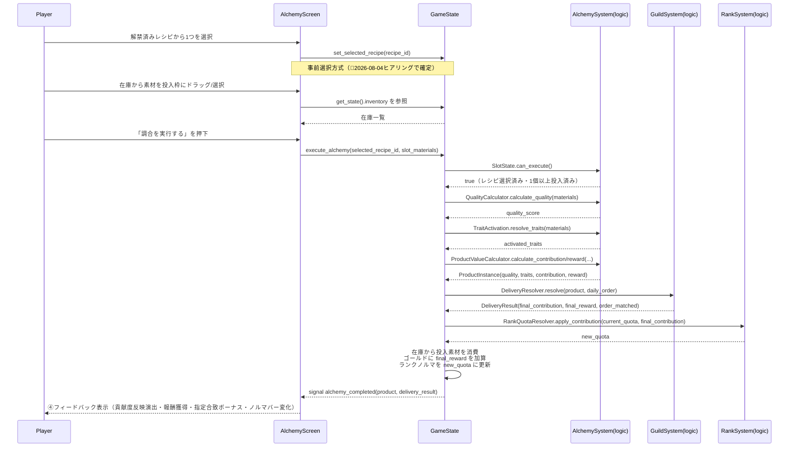
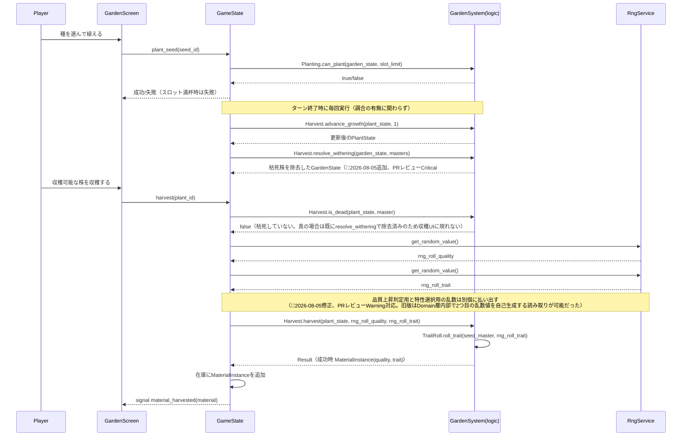
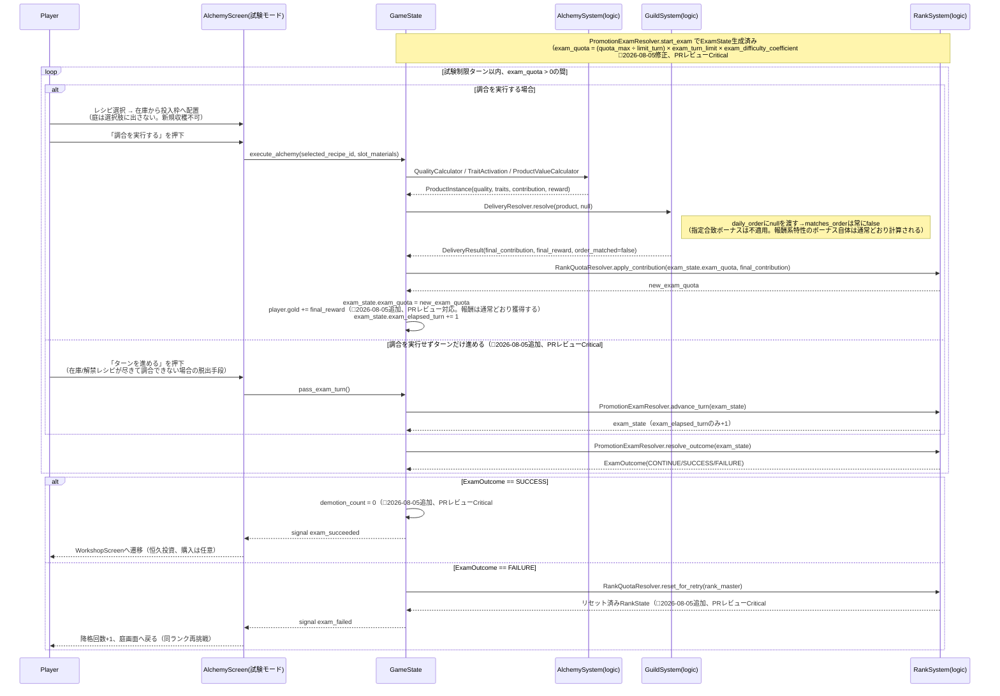
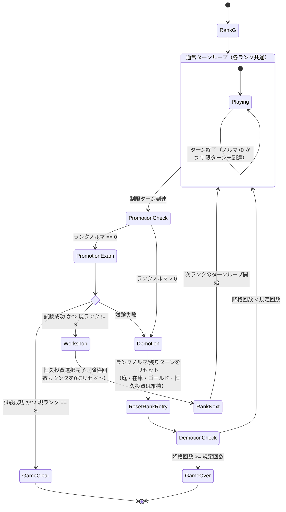

# データフロー図

作成日: 2026-08-04
準拠要件: [`../../spec/atelier-alchemy-core/requirements.md`](../../spec/atelier-alchemy-core/requirements.md)

## ゲーム全体のフロー

🔵 全体フローは要件定義書§1「プレイサイクル」・§2「勝敗条件」の記述をそのまま図式化したもの。「昇格試験」ボックスの内部詳細は[`core-systems.md`](./core-systems.md) RankSystem節、および本文書「昇格試験のデータフロー」を参照。

🔴 **2026-08-06追加（実装レディネス監査対応）**: `EndTurn`ノードは、庭画面・調合画面の`btn-end-turn`（[`ui-design/screens/garden.md`](./ui-design/screens/garden.md)・[`ui-design/screens/alchemy.md`](./ui-design/screens/alchemy.md) 参照）押下で呼ばれる`GameState.end_turn()`に対応する。`end_turn()`は`GrowGarden`（`Harvest.advance_growth`）→`Wither`（`Harvest.resolve_withering`）→`UpdateOrder`（`daily_order`再抽選）→`CheckRank`（`TurnLimitResolver.is_turn_limit_reached`）以降の分岐までを1回の呼び出しで同期的に実行する。旧版はこの呼び出し元（UIのどの操作がこの一連の処理をトリガーするか）が全設計文書から欠落していた。

## 調合実行のデータフロー（★ゲームの核心）

🔵 要件定義書§1「③結果反映」の内容をシーケンス図化。呼び出し順序（品質計算→特性発現→価値算出→納品判定→ノルマ反映）は本文書での設計判断（🟡）だが、各ステップの計算式自体は要件定義書§4「調合物（Product）」に明記された式に忠実。指定合致ボーナスは`ProductValueCalculator`ではなく`DeliveryResolver.resolve`が一手に適用する（🔵2026-08-05修正、PRレビューCritical#4対応。[`core-systems.md`](./core-systems.md) AlchemySystem節参照）。

## 庭（栽培）のデータフロー

🔵 要件定義書§3「庭（仕込み層）」の操作をシーケンス図化。

## 昇格試験のデータフロー（🔵2026-08-04ヒアリングで確定）

昇格試験は「調合実行のデータフロー」と同一の呼び出し列を流用する。差分は❶庭を経由しない、❷`daily_order`を渡さない、❸反映先が`RankState.quota`ではなく`ExamState.exam_quota`である点のみ。

🔵 呼び出し順序は「調合実行のデータフロー」と同一（[`core-systems.md`](./core-systems.md) RankSystem節参照）。ループの終了条件（`exam_elapsed_turn >= exam_turn_limit`）は`PromotionExamResolver.resolve_outcome`が判定する。

## ランク進行・昇格試験の状態遷移

🔵 要件定義書§2「勝敗条件」の「降格」定義（ランク文字は下がらず同一ランクに留まる）に忠実に、`Demotion`から`TurnLoop`へ戻る遷移（ランクは変わらない）として表現した。

🔵 **2026-08-05修正（PRレビューWarning対応）**: 旧版は「試験成功→常にWorkshop経由→RankNext→（Sランクだった場合のみ）GameClear」という経路になっており、全体フロー図（本文書冒頭）の「Sランクは工房強化を経由せず直接ゲームクリア」という経路と矛盾していた。次ランクが存在しないSランクで恒久投資画面を経由する意味がないため、`PromotionExam2`からの分岐時点でSランクなら`GameClear`へ直接遷移するよう修正した。あわせて降格時のランクノルマ/残りターンのリセット、昇格成功時の降格回数カウンタのリセットも明示した（[`core-systems.md`](./core-systems.md) RankSystem節参照）。
