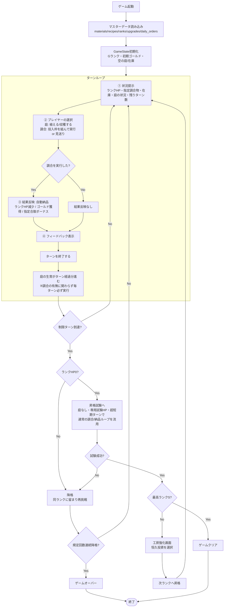
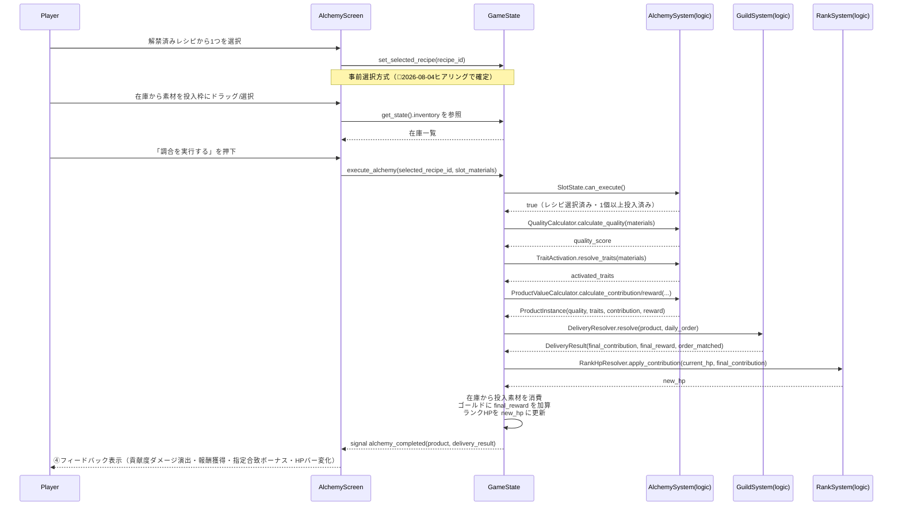
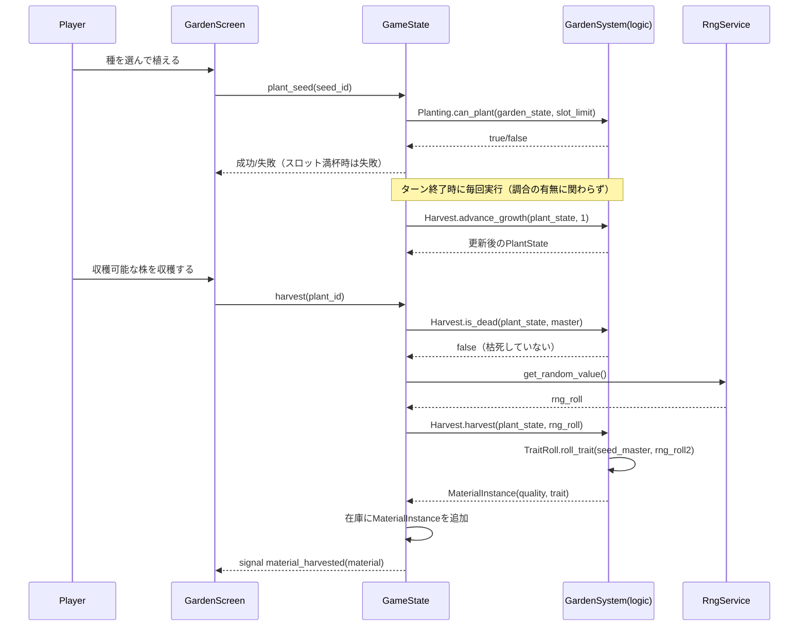
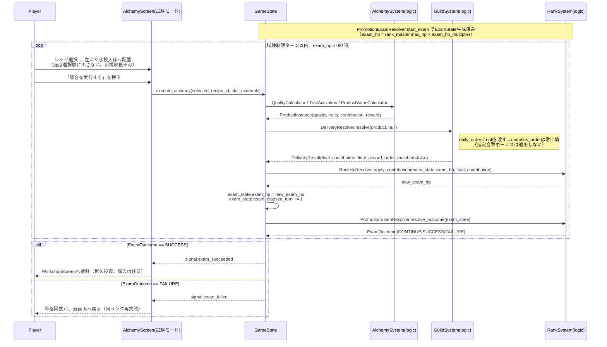
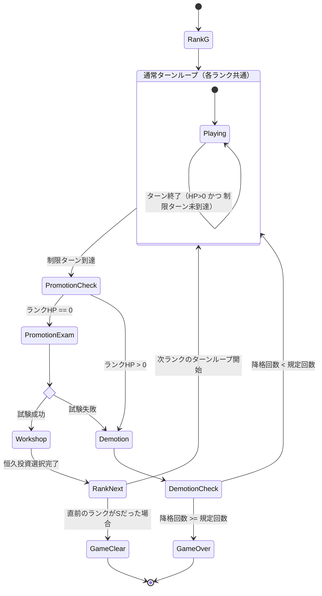

# データフロー図

作成日: 2026-08-04
準拠要件: [`../../spec/atelier-alchemy-core/requirements.md`](../../spec/atelier-alchemy-core/requirements.md)

## ゲーム全体のフロー

🔵 全体フローは要件定義書§1「プレイサイクル」・§2「勝敗条件」の記述をそのまま図式化したもの。「昇格試験」ボックスの内部詳細は[`core-systems.md`](./core-systems.md) RankSystem節、および本文書「昇格試験のデータフロー」を参照。

## 調合実行のデータフロー（★ゲームの核心）

🔵 要件定義書§1「③結果反映」の内容をシーケンス図化。呼び出し順序（品質計算→特性発現→価値算出→納品判定→HP反映）は本文書での設計判断（🟡）だが、各ステップの計算式自体は要件定義書に明記された式（L117-118）に忠実。

## 庭（栽培）のデータフロー

🔵 要件定義書§3「庭（仕込み層）」の操作をシーケンス図化。

## 昇格試験のデータフロー（🔵2026-08-04ヒアリングで確定）

昇格試験は「調合実行のデータフロー」と同一の呼び出し列を流用する。差分は❶庭を経由しない、❷`daily_order`を渡さない、❸反映先が`RankState.rank_hp`ではなく`ExamState.exam_hp`である点のみ。

🔵 呼び出し順序は「調合実行のデータフロー」と同一（[`core-systems.md`](./core-systems.md) RankSystem節参照）。ループの終了条件（`exam_elapsed_turn >= exam_turn_limit`）は`PromotionExamResolver.resolve_outcome`が判定する。

## ランク進行・昇格試験の状態遷移

🔵 要件定義書§2「勝敗条件」の「降格」定義（ランク文字は下がらず同一ランクに留まる）に忠実に、`Demotion`から`TurnLoop`へ戻る遷移（ランクは変わらない）として表現した。
