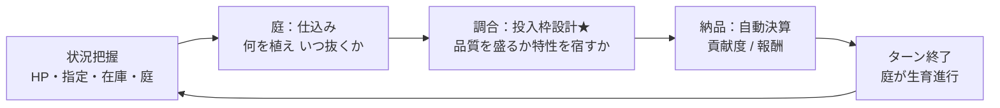
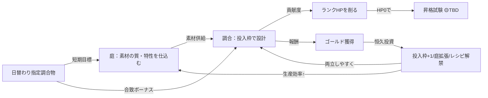

# ゲームメカニクス設計

準拠要件: [`../../spec/atelier-alchemy-core/requirements.md`](../../spec/atelier-alchemy-core/requirements.md)
準拠コンセプト: [`../../concept/atelier-concept.md`](../../concept/atelier-concept.md)（v7.0）

> **信頼性レベル凡例**: 🔵 要件/コンセプト準拠 ／ 🟡 妥当な推測 ／ 🔴 新規推測

---

## コアゲームループ

🔵 三段構成＝庭（仕込み・戦略層）→ 調合（主戦場・戦術層）→ ギルド納品（決算・自動）。



---

## 基本ルール

### ゲーム目標

🔵 ギルドランク G→F→E→D→C→B→A→S を順に攻略し、各ランクで制限ターン内にランクHPを0にして昇格試験を突破する。Sランクの昇格試験をクリアすればゲームクリア。

### 基本的な遊び方

🔵
1. 本日の指定調合物を確認し、必要な素材を庭に仕込む（種を植える）
2. ターンを進めて素材を育て、狙ったタイミングで収穫する（品質確定・特性付与）
3. 調合台の投入枠（4枠）に在庫素材を配置し、品質を盛るか特性を宿すかを設計して調合を実行する
4. 完成品が自動でギルドに納品され、貢献度でランクHPが減り、報酬でゴールドを得る
5. ゴールドを工房強化（投入枠+1・庭拡張・レシピ解禁）や消耗投資（触媒・種）に投じ、生産効率を上げる
6. 制限ターン内にHPを0にして昇格試験へ挑む

### 段階的開示（特性の解禁）

🔵 コンセプト「段階的開示」に準拠。

| ランク | 解禁要素 | 判断の重さ |
|--------|---------|-----------|
| G | 植える→収穫→調合の基本（**特性は封印**、品質のみ） | 軽い |
| F | 品質を意識した調合、投入枠の感覚 | 軽〜中 |
| E | **貢献度系/報酬系の特性が解禁**、二分を意識 | 中 |
| D | 品質 vs 特性の食い合いを最適化、指定調合物に対応 | 中〜重 |
| C-B | 限られた在庫と枠でトレードオフを詰める | 重い |
| A-S | ギリギリの調合設計、最終試験 | 最大 |

---

## 勝利条件

| 条件名 | 説明 | 判定タイミング |
|--------|------|---------------|
| ゲームクリア | 🔵 Sランクの昇格試験をクリアする | 昇格試験終了時 |
| ランク突破 | 🔵 制限ターン内にランクHPを0にし、昇格試験に成功する | 制限ターン到達時→試験 |

## 敗北条件

| 条件名 | 説明 | 判定タイミング |
|--------|------|---------------|
| ゲームオーバー | 🔵 同一ランクで規定回数（仮3回）連続して降格した場合 | 昇格試験失敗時（降格回数加算後） |

> 🔵 **継続不能条件はなし**。デッキ切れのようなシステムはなく、素材が尽きても庭で仕込み直せば回復できる（[`requirements.md`](../../spec/atelier-alchemy-core/requirements.md) 2章）。「降格」はランク文字の低下ではなく同一ランクでの再挑戦を指す。

---

## 調合の核心メカニクス（★確定仕様 v7.0）

🔵 投入枠は限られた資源。品質を取るか特性を取るかの択一が毎ターン発生する。

### 品質

- 🔵 調合物の品質 = **投入素材の平均品質**（D〜S＝1〜5）
- 🔵 高品質・無特性素材で枠を埋めると「凡庸な高品質品」になる

### 特性発現（閾値発現）

- 🔵 **同一特性タグを持つ素材を2個以上**投入枠に入れると、その特性が成果物に宿る（1個では不発）
- 🔵 3個目以降を追加してもボーナスは据え置き（重複強化なし）
- 🔵 特性を宿すには2枠以上を割く必要があり、その枠を高品質素材に使えず品質が下がる＝**食い合い（トレードオフ）**

### 特性の二分

| 系統 | タグ例 | 効果 |
|------|--------|------|
| 貢献度系 | 聖・浄・癒 | 🔵 貢献度（ランクHP削り）にボーナス |
| 報酬系 | 金・華・稀 | 🔵 報酬（ゴールド）にボーナス |
| 補助系 | 触媒 | 🔵 品質+1段（ショップ購入の素材） |

> 🔵 特性は素材段階から貢献度向き/報酬向きに分岐するため、庭の仕込みの時点で「ランクを削る品を作るか、稼いで強化する品を作るか」の先行投資になる（真のトレードオフ）。

### 投入枠の制約

- 🔵 枠数を超えて同時投入できない（初期4、恒久投資で最大5）
- 🔵 **最低1個以上投入されていなければ調合を実行できない**（0個投入は実行不可）

---

## 計算式

### 調合物品質

```
調合物品質 = average(投入素材の品質スコア)   （1〜5、D〜S）
```
🔵 旧Phaser版 `calculateQuality` の**計算式・アルゴリズム仕様**をGDScriptで再実装（コード移植ではなく仕様移植）。

### 品質倍率

```
品質倍率 = f(調合物品質)   （仮 1.0〜2.0倍）
```
🟡 旧Phaser版 `calculateAverageQualityMultiplier` の仕様を再実装。具体値は🟡 TBD。

### 貢献度

```
貢献度 = 基礎貢献度 × 品質倍率 × 貢献度系特性ボーナス × 指定合致ボーナス
```

| パラメータ | 説明 | 範囲 |
|-----------|------|------|
| 基礎貢献度 | 🔵 レシピごとの基礎値（マスターデータ） | 🟡 TBD |
| 品質倍率 | 🔵 品質に応じた倍率 | 🟡 仮1.0〜2.0 |
| 貢献度系特性ボーナス | 🔵 発現した貢献度系特性による倍率（未発現なら1.0） | 🟡 TBD |
| 指定合致ボーナス | 🔵 本日の指定調合物に合致で加算 | 🟡 仮1.2〜1.5 |

### 報酬

```
報酬 = 基礎報酬 × 品質倍率 × 報酬系特性ボーナス × 指定合致ボーナス
```
🔵 構造は貢献度と対称。特性ボーナスは報酬系のものを参照。

### ランクHP減算

```
新HP = max(0, 現HP − 貢献度)
```
🔵 0未満にはならず0でクランプ、オーバーキル分は切り捨て（[`requirements.md`](../../spec/atelier-alchemy-core/requirements.md) 4章）。

---

## 収穫と枯死のメカニクス

🔵
- 成熟後に放置すると品質が上がるが、**枯死猶予ターン**を超えると枯死（全損）
- 「今Bで抜くか、S狙いで賭けるか」を毎回判断（手動収穫）
- 収穫時に特性が1つ乱数付与される（分散のみ・期待値不動。種やシナジーで狙いを絞れる）
- 素材の種類ごとに成熟ターン数が異なる（早熟＝薬草、晩成＝希少鉱石）

---

## ゲームシステム相互作用



> 🔵 **複利ループ**: 早めに恒久投資へ金を回すほど後半の生産効率が上がる。ただし投資に回したターンは貢献度を稼げないため、「今削るか、投資して後で速く削るか」が硬い締切（制限ターン・延長不可）に対する賭けになる。
