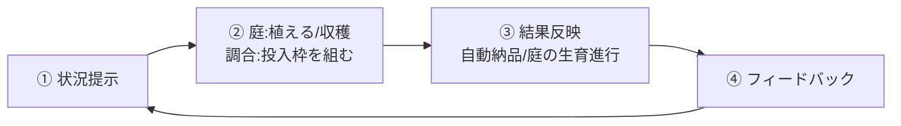
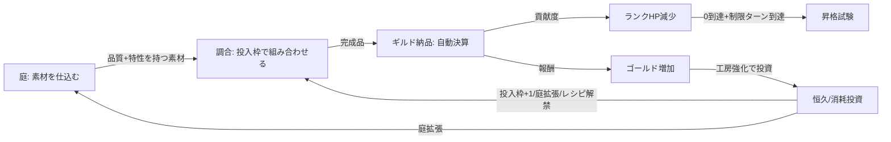

# ゲームメカニクス設計

作成日: 2026-08-04
準拠要件: [`../../spec/atelier-alchemy-core/requirements.md`](../../spec/atelier-alchemy-core/requirements.md)（以下「要件定義書」）

## コアゲームループ



🔵 要件定義書§1「プレイサイクル」に忠実。

## 基本ルール

### ゲーム目標

錬金術師（プレイヤー）が、庭で品質・特性を持つ素材を仕込み、調合台の投入枠（4枠）で「品質を盛るか特性を宿すか」のトレードオフをしながら調合物を作り、ギルドへ自動納品してランク（＝敵）のHPを削り、G→F→E→D→C→B→A→Sの全ランクを攻略してゲームクリアを目指す。

🔵 コンセプト文書 §1「ワンセンテンス・コンセプト」に忠実。

### 基本的な遊び方

1. ターン開始時に本日の指定調合物・ランクHP残量・残りターン数を確認する
2. 庭で種を植える、または育った素材を収穫する
3. 調合台の投入枠（4枠）に在庫の素材を組み合わせ、品質を取るか特性を宿すかを判断して調合を実行する
4. 完成品は自動でギルドに納品され、貢献度（ランクHPダメージ）と報酬（ゴールド）を得る
5. ターンを終了すると庭の生育が進む。制限ターン到達時にランクHPが0なら昇格試験、0でなければ降格（同一ランク再挑戦）

🔵 要件定義書§1に忠実。

## 勝利条件

| 条件名 | 説明 | 判定タイミング |
|--------|------|---------------|
| ゲームクリア | 最高ランク（S）の昇格試験をクリアする | 昇格試験成功時、かつ現在ランクがS |

🔵 要件定義書§2 L52に忠実。

## 敗北条件

| 条件名 | 説明 | 判定タイミング |
|--------|------|---------------|
| ゲームオーバー | 同一ランクで規定回数（🟡TBD、仮3回）連続して降格した場合 | 昇格試験失敗による降格回数カウンタ更新時 |

🔵 要件定義書§2 L53に忠実。「継続不能条件」（デッキ切れ等）は存在しない（要件定義書L56）。

## ランクループの判定フロー

要件定義書L45・L57-59、および[`dataflow.md`](./dataflow.md)「ランク進行・昇格試験の状態遷移」を参照。

- 制限ターン内にランクHPを0にできれば昇格試験へ（一発勝負の特殊局面）
- 昇格試験成功 → 次ランクへ昇格し工房強化画面（恒久投資）へ
- 昇格試験失敗、または制限ターン到達時にランクHPが0でない → 降格（ランク文字は下がらず同一ランクに留まって再挑戦。降格回数カウンタ+1）

🔵 要件定義書§2の「降格」定義（L55）に忠実。

## 計算式

### 品質計算

```
品質スコア = 投入素材の品質スコアの平均（旧Phaser版 calculateQuality の仕様移植）
```

| パラメータ | 説明 | 範囲 |
|-----------|------|------|
| 品質スコア | D〜Sの5段階を1〜5の整数で表現 | 1〜5 |

🔵 要件定義書L115・L146に忠実。平均の端数は**四捨五入**する（🔵2026-08-04ヒアリングで確定、要件定義書§4「調合物（Product）」参照）。

### 品質倍率

```
品質倍率 = quality_multiplier(品質スコア)  （旧Phaser版 calculateAverageQualityMultiplier の仕様移植）
```

具体的な数値テーブルは🟡TBD（要件定義書L154「仮1.0〜2.0倍」）。

### 特性発現判定

```
特性は「同一特性タグを持つ素材が投入枠内に2個以上」あれば発現する（ブール値。3個以上でも据え置き）
```

🔵 要件定義書L112・L147に忠実（確定仕様）。

### 貢献度・報酬

```
貢献度 = 基礎貢献度 × 品質倍率 × 貢献度系特性ボーナス × 指定合致ボーナス
報酬   = 基礎報酬   × 品質倍率 × 報酬系特性ボーナス   × 指定合致ボーナス
```

| パラメータ | 説明 | 範囲 |
|-----------|------|------|
| 基礎貢献度／基礎報酬 | 調合実行前にプレイヤーが事前選択したレシピ（`RecipeMaster`）から取得（🔵2026-08-04ヒアリングで事前選択方式に確定） | 🟡数値TBD |
| 品質倍率 | 品質スコアに応じた乗数 | 🟡TBD |
| 貢献度系／報酬系特性ボーナス | 発現特性ごとの乗数（複数発現時は乗算合成） | 🟡数値TBD |
| 指定合致ボーナス | 日替わり指定調合物に合致した場合の追加倍率 | 🟡TBD（仮1.2〜1.5倍） |

🔵 式自体は要件定義書L117-118に忠実。特性ボーナスの合成方法（乗算）・レシピの事前選択方式はいずれも2026-08-04のヒアリングで確定済み（[`core-systems.md`](./core-systems.md) AlchemySystem節参照）。

### ランクHP減算

```
新ランクHP = max(0, 現ランクHP - 貢献度)
```

🔵 要件定義書L126「0未満にはならず0でクランプ。オーバーキル分は切り捨て」に忠実。

## ゲームシステム相互作用



🔵 コンセプト文書§5「メインループ」の三段構成＋工房強化の複利ループを図式化。

---

## 昇格試験について（🔵2026-08-04ヒアリングで確定）

昇格試験は「通常ターンループの調合・納品をそのまま流用した、一発勝負の圧縮ラウンド」として設計する。新規のミニゲームは発明せず、既存システムの組み合わせだけで成立させる方針とした。

- **発生条件・画面遷移・成功/失敗時の遷移先**: [`core-systems.md`](./core-systems.md) RankSystem節、[`dataflow.md`](./dataflow.md) の状態遷移図で確定
- **試験中の操作**: 通常ターンと同じ「レシピ選択→投入枠に素材を組む→調合を実行する」。ただし以下3点が通常ターンと異なる（[`core-systems.md`](./core-systems.md) 参照）
  1. 庭は使用不可（新規の種植え・収穫ができず、それまでの在庫のみで挑む）
  2. 試験専用のHP（`ExamState.exam_hp`）を使用し、通常のランクHPとは別管理
  3. 日替わり指定調合物の合致ボーナスは適用されない
- **判定ロジック**: `PromotionExamResolver.resolve_outcome`（[`core-systems.md`](./core-systems.md) 参照）。試験HPが0になれば成功、超短期の制限ターン（🟡TBD、仮1〜2ターン）到達時に0でなければ失敗
- **残る未確定事項**: 試験HP倍率・制限ターン数の具体値（🟡TBD、[`balance-design.md`](./balance-design.md) 参照）、ターン経過のトリガー方法（1行動=1ターンか、明示的なターン終了操作か）、演出の詳細

---

## 未確定事項（🟡🔴 本文書で新たに洗い出したもの。既存の要件定義書§7の項目は転記しない）

> 2026-08-04のヒアリングにより、品質スコア平均の丸め方（→四捨五入）・特性ボーナス複数発現時の合成方法（→乗算）・「触媒」の発現閾値ルール適用有無（→対象外・個別処理）・レシピの調合結果への影響方法（→事前選択方式）・昇格試験のルール自体（→通常ループの調合/納品を庭なし・専用HP・指定調合物ボーナスなしで流用）はいずれも確定済みのため本節から除外した。

- 昇格試験中のターン経過トリガー（1行動=1ターンか、明示的なターン終了操作かは本文書の提案段階。プロトタイプでの検証を推奨）
- 昇格試験の試験HP倍率・制限ターン数の具体値（数値そのものはバランス調整フェーズでのTBD）
