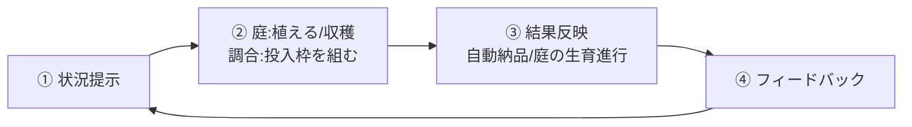
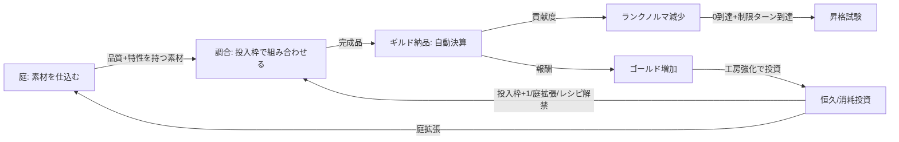

# ゲームメカニクス設計

作成日: 2026-08-04
準拠要件: [`../../spec/atelier-alchemy-core/requirements.md`](../../spec/atelier-alchemy-core/requirements.md)（以下「要件定義書」）

## コアゲームループ



🔵 要件定義書§1「プレイサイクル」に忠実。

## 基本ルール

### ゲーム目標

錬金術師（プレイヤー）が、庭で品質・特性を持つ素材を仕込み、調合台の投入枠（4枠）で「品質を盛るか特性を宿すか」のトレードオフをしながら調合物を作り、ギルドへ自動納品してランクのノルマをこなし、G→F→E→D→C→B→A→Sの全ランクを攻略してゲームクリアを目指す。

🔵 コンセプト文書 §1「ワンセンテンス・コンセプト」に忠実。

### 基本的な遊び方

1. ターン開始時に本日の指定調合物・ランクノルマ残量・残りターン数を確認する
2. 庭で種を植える、または育った素材を収穫する
3. 調合台の投入枠（4枠）に在庫の素材を組み合わせ、品質を取るか特性を宿すかを判断して調合を実行する
4. 完成品は自動でギルドに納品され、貢献度（ランクノルマの消化）と報酬（ゴールド）を得る
5. ターンを終了すると庭の生育が進む。制限ターン到達時にランクノルマが0なら昇格試験、0でなければ降格（同一ランク再挑戦）

🔵 要件定義書§1に忠実。

## 勝利条件

| 条件名 | 説明 | 判定タイミング |
|--------|------|---------------|
| ゲームクリア | 最高ランク（S）の昇格試験をクリアする | 昇格試験成功時、かつ現在ランクがS |

🔵 要件定義書§2「勝敗条件」に忠実。

## 敗北条件

| 条件名 | 説明 | 判定タイミング |
|--------|------|---------------|
| ゲームオーバー | 同一ランクで規定回数（🟡TBD、仮3回）降格した場合 | 昇格試験失敗による降格回数カウンタ更新時 |

🔵 要件定義書§2「勝敗条件」に忠実。「継続不能条件」（デッキ切れ等）は存在しない（同節）。

## ランクループの判定フロー

要件定義書§1「プレイサイクル」・§2「勝敗条件」、および[`dataflow.md`](./dataflow.md)「ランク進行・昇格試験の状態遷移」を参照。

- **制限ターン到達時点で**ランクノルマが0になっていれば昇格試験へ（一発勝負の特殊局面）。ランクノルマが制限ターンより先に0に到達しても、試験への移行は制限ターン到達まで待つ（早期クリア後の残りターンは意図的な報酬稼ぎボーナス期間として許容する。確定仕様、要件定義書§2参照）
- 昇格試験成功 → 次ランクへ昇格し工房強化画面（恒久投資、購入は任意）へ。降格回数カウンタを0にリセット
- 昇格試験失敗、または制限ターン到達時にランクノルマが0でない → 降格（ランク文字は下がらず同一ランクに留まって再挑戦。ランクノルマ/残りターンをリセットし、降格回数カウンタ+1）

🔵 要件定義書§2の「降格」定義・「降格時のリセット規定」に忠実。

## 計算式

### 品質計算

```
品質スコア = round(投入素材の品質スコアの平均)
触媒タグを持つ素材が1個以上含まれる場合、上記の結果に+1し、上限5でクランプする
```

| パラメータ | 説明 | 範囲 |
|-----------|------|------|
| 品質スコア | D〜Sの5段階を1〜5の整数で表現 | 1〜5 |

🔵 要件定義書§4「調合物（Product）」「特性タグ（Trait）」に忠実。平均の端数は**四捨五入**する（確定仕様）。触媒の効果は**平均・四捨五入後の最終品質**に+1する（🔵2026-08-05修正、PRレビューCritical#6対応。旧仕様「素材自身の品質に+1」は平均計算で効果がほぼ相殺され消えてしまう欠陥があったため撤回した）。

### 品質倍率

```
品質倍率 = quality_multiplier(品質スコア)
```

品質スコア（1〜5）に対する単調非減少の乗数テーブル。具体的な数値テーブルは🟡TBD（要件定義書§5「数値設計」仮1.0〜2.0倍）。

### 特性発現判定

```
特性は「同一特性タグを持つ素材が投入枠内に2個以上」あれば発現する（ブール値。3個以上でも据え置き）
```

🔵 要件定義書§4「特性タグ（Trait）」に忠実（確定仕様）。触媒はこの閾値ルールの対象外（上記「品質計算」参照）。

### 貢献度・報酬（調合時点、指定合致ボーナスを含まない）

```
貢献度（調合時点） = 基礎貢献度 × 品質倍率 × 貢献度系特性ボーナス
報酬（調合時点）   = 基礎報酬   × 品質倍率 × 報酬系特性ボーナス
```

| パラメータ | 説明 | 範囲 |
|-----------|------|------|
| 基礎貢献度／基礎報酬 | 調合実行前にプレイヤーが事前選択したレシピ（`RecipeMaster`）から取得（🔵2026-08-04ヒアリングで事前選択方式に確定） | 🟡数値TBD |
| 品質倍率 | 品質スコアに応じた乗数 | 🟡TBD |
| 貢献度系／報酬系特性ボーナス | 発現特性ごとの乗数（同系統内で複数発現時は乗算合成。異なる系統間では乗算しない） | 🟡数値TBD |

🔵 式自体は要件定義書§4「調合物（Product）」に忠実。特性ボーナスの合成方法（乗算）・レシピの事前選択方式はいずれも確定済み（[`core-systems.md`](./core-systems.md) AlchemySystem節参照）。

### 指定合致ボーナス（納品時点、`GuildSystem.DeliveryResolver`が適用）

```
最終貢献度 = 貢献度（調合時点） × (指定調合物に合致 ? 指定合致ボーナス倍率 : 1.0)
最終報酬   = 報酬（調合時点）   × (指定調合物に合致 ? 指定合致ボーナス倍率 : 1.0)
```

| パラメータ | 説明 | 範囲 |
|-----------|------|------|
| 指定合致ボーナス倍率 | 日替わり指定調合物に合致した場合の追加倍率 | 🟡TBD（仮1.2〜1.5倍） |

🔴 **2026-08-05修正（PRレビューCritical#4対応）**: 旧版は指定合致ボーナスを「貢献度・報酬」の式に直接含めていたが、`ProductValueCalculator`（調合時点の価値算出）と`GuildSystem.DeliveryResolver`（納品時点の合致判定・ボーナス適用）の両方に適用責務があるように読め、実装すると二重に乗算されるバグになることが判明したため、式を「調合時点」と「納品時点（指定合致ボーナス適用後）」の2段階に分離した。昇格試験中は`daily_order`が常に`null`扱いのため、最終貢献度・最終報酬は常に「調合時点」の値と一致する（[`core-systems.md`](./core-systems.md) RankSystem節参照）。

### ランクノルマ減算

```
新ランクノルマ = max(0, 現ランクノルマ - 最終貢献度)
```

🔵 要件定義書§4「ギルドランク（審査基準）」の「0未満にはならず0でクランプ。超過分は切り捨て」に忠実。

## ゲームシステム相互作用



🔵 コンセプト文書§5「メインループ」の三段構成＋工房強化の複利ループを図式化。

---

## 昇格試験について（🔵2026-08-04ヒアリングで確定）

昇格試験は「通常ターンループの調合・納品をそのまま流用した、一発勝負の圧縮ラウンド」として設計する。新規のミニゲームは発明せず、既存システムの組み合わせだけで成立させる方針とした。

- **発生条件・画面遷移・成功/失敗時の遷移先**: [`core-systems.md`](./core-systems.md) RankSystem節、[`dataflow.md`](./dataflow.md) の状態遷移図で確定
- **試験中の操作**: 通常ターンと同じ「レシピ選択→投入枠に素材を組む→調合を実行する」に加えて、調合を実行せずにターンだけ進める操作（`PromotionExamResolver.advance_turn`）が可能。以下4点が通常ターンと異なる（[`core-systems.md`](./core-systems.md) 参照）
  1. 庭は使用不可（新規の種植え・収穫ができず、それまでの在庫のみで挑む）
  2. 試験専用のノルマ（`ExamState.exam_quota`）を使用し、通常のランクノルマとは別管理。算出式は「当該ランクの1手あたり期待貢献度 × 試験制限ターン数 × 難度係数」
  3. 日替わり指定調合物の合致ボーナスは適用されない（報酬〔ゴールド〕自体は通常どおり獲得できる）
  4. 調合を実行しなくてもターンを進められる（在庫や解禁レシピが尽きた場合の脱出手段）
- **判定ロジック**: `PromotionExamResolver.resolve_outcome`（[`core-systems.md`](./core-systems.md) 参照）。試験ノルマが0になれば成功、超短期の制限ターン（🟡TBD、仮1〜2ターン）到達時に0でなければ失敗
- **残る未確定事項**: 試験ノルマ難度係数・制限ターン数の具体値（🟡TBD、[`balance-design.md`](./balance-design.md) 参照）、演出の詳細

---

## 未確定事項（🟡🔴 本文書で新たに洗い出したもの。既存の要件定義書§7の項目は転記しない）

> 2026-08-04のヒアリングにより、品質スコア平均の丸め方（→四捨五入）・特性ボーナス複数発現時の合成方法（→乗算）・「触媒」の発現閾値ルール適用有無（→対象外・個別処理）・レシピの調合結果への影響方法（→事前選択方式）・昇格試験のルール自体（→通常ループの調合/納品を庭なし・専用ノルマ・指定調合物ボーナスなしで流用）はいずれも確定済みのため本節から除外した。
>
> 2026-08-05のPRレビュー対応により、以下も確定済みのため除外した: 指定合致ボーナスの適用箇所（→`DeliveryResolver`に一本化）、触媒の適用位置（→最終品質に+1・上限5クランプ）、昇格試験の試験ノルマ算出式（→期待貢献度基準）、昇格試験中のターン経過トリガー（→調合実行 or 明示的な「ターンを進める」操作のいずれか）、昇格試験中の報酬獲得可否（→通常どおり獲得）。

- 昇格試験の試験ノルマ難度係数・制限ターン数の具体値（数値そのものはバランス調整フェーズでのTBD）
