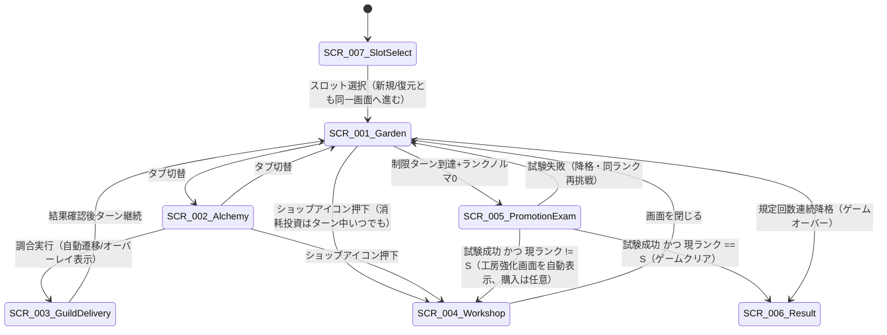

# UI設計概要

作成日: 2026-08-04
準拠要件: [`../../../spec/atelier-alchemy-core/requirements.md`](../../../spec/atelier-alchemy-core/requirements.md)（以下「要件定義書」）

> ⚠️ `.claude/rules/design-guide.md` は「水彩ファンタジースタイル」を採用し、詳細は `docs/design/atelier-guild-rank/ui-design/design-guide.md` を参照するよう定めているが、このパスは旧Phaser版（`atelier-guild-rank`）のもので本リポジトリには存在しない。本文書のカラーパレット等は**暫定案**であり、正式なビジュアルデザインガイド策定は本`/game-design`の対象外として別途行うことを推奨する。

## 画面一覧

要件定義書・コンセプト文書のスコープに基づき、対象画面を以下7画面とする（ユーザーとの確認により確定）。タイトル画面・設定画面は要件定義書の設計スコープ外（`CLAUDE.md`参照）のため引き続き対象外とする。セーブロード画面（スロット選択画面）は2026-09-05時点で実装済み（PR #45）のため対象に含める（🔵2026-09-05修正。旧版は「タイトル画面・設定画面・セーブロード画面は…対象外とする」としていたが、セーブ/ロード機能がスコープに追加され実装されたため修正した）。

| 画面ID | 画面名 | 説明 | 詳細ファイル |
|--------|--------|------|-------------|
| SCR-001 | 庭画面 | 種植え・収穫・生育状況の確認 | [garden.md](screens/garden.md) |
| SCR-002 | 調合画面 | 投入枠への素材配置・調合実行（★核心） | [alchemy.md](screens/alchemy.md) |
| SCR-003 | ギルド納品画面 | 自動決算の結果確認（操作なし） | [guild-delivery.md](screens/guild-delivery.md) |
| SCR-004 | 工房強化・ショップ画面 | 恒久投資/消耗投資の購入 | [workshop-shop.md](screens/workshop-shop.md) |
| SCR-005 | 昇格試験画面 | ランク到達時の特殊局面。庭なし・専用試験ノルマ・超短期ターンで調合画面をほぼ流用（🔵2026-08-04確定、数値は🟡TBD） | [promotion-exam.md](screens/promotion-exam.md) |
| SCR-006 | 結果画面（ゲームクリア/ゲームオーバー） | Sランク昇格試験成功、または規定回数連続降格時の終了画面 | 🔴2026-08-05追加、PRレビューWarning対応。旧版は`architecture.md`の`ResultScene`定義と画面一覧が不整合だった。詳細設計は未作成（🟡TBD） |
| SCR-007 | スロット選択画面 | 起動直後、3固定セーブスロットから選択する画面。空スロットは新規開始、既存スロットは復元して`SCR-001`へ進む。破損スロットは警告表示のみ行い選択自体は妨げない | 🔵2026-09-05追加、実装〔PR #45〕反映。詳細設計ファイルは未作成（実装は`atelier/features/save_load/ui/slot_select_screen.gd`参照）。タイトル画面を経由せず`BootScene`の直後に表示される |

## 画面遷移図

🔵 **2026-08-05修正（PRレビュー対応）**: 「試験成功（恒久投資選択強制）」という遷移ラベルは、恒久投資の**購入**が任意である（要件定義書§3「工房強化・ショップ」）こととの誤解を招くため、「工房強化画面を自動表示、購入は任意」に修正した。Sランク試験成功時は工房強化を経由せず直接`SCR-006`（結果画面）へ遷移するよう追加した（次ランクが存在せず恒久投資が無意味なため。[`../dataflow.md`](../dataflow.md) 参照）。

🟡 「庭画面⇔調合画面」をタブで自由行き来できる設計、および「ギルド納品画面」を調合実行後に挟む（自動決算だが一瞬結果を見せる）設計は、要件定義書に画面遷移の明示規定がないための本文書での提案（[`architecture.md`](../architecture.md) のシーン遷移図と同一方針）。

🔵 **2026-09-05追加（実装〔PR #45〕反映）**: `SCR-007`（スロット選択画面）は`BootScene`の直後・`SCR-001`（庭画面）を含む`MainScene`一式より前に表示される。新規スロット（空）を選んだ場合と既存スロットを選んで復元した場合はいずれも同じ`SCR-001`へ遷移する（復元処理はマスターデータロード完了後に内部で適用されるため、遷移図上は分岐しない）。破損スロットを選んだ場合は警告表示のみでスロット選択画面に留まり、別スロットの選択または同スロットでの新規開始が可能（遷移図には表現していない画面内分岐）。

## 共通UIコンポーネント

### RankHud（全画面共通、常時表示）

🔴2026-08-06追加、実装レディネス監査対応。旧版はRankHudの構成要素が独立して定義されておらず、所持ゴールドの表示要素がworkshop-shop.mdの`txt-gold`にしか存在しなかった。RankHudは以下を常時表示する共通コンポーネントとして定義する。

| 要素ID | 内容 |
|--------|------|
| txt-rank-name | 現在ランク（G〜S） |
| bar-rank-quota | ランクノルマバー |
| txt-turn-remaining | 残りターン数（`rank_state.limit_turn - rank_state.elapsed_turn`） |
| txt-gold | 所持ゴールド（`player.gold`）。ショップ画面固有ではなく全画面共通表示とする |

### ボタン

- **プライマリボタン**: 確定アクション（調合を実行する、収穫する、購入する等）
- **セカンダリボタン**: キャンセル、投入取り消し、画面を閉じる等の副次アクション
- **危険ボタン**: なし（要件定義書の操作一覧に不可逆の破棄アクションは存在しないため。TBD: 実装中に必要になれば追加）

🟡 `.claude/rules/design-guide.md`のボタン4種（プライマリ/セカンダリ/デンジャー/ターシャリ）はPhaser版UIコンポーネント体系の踏襲を前提としており、Godot版でどこまで同一体系を踏襲するかは未確定。本文書では意味的に対応するプライマリ/セカンダリの2種のみを暫定的に設計し、残りは実装時のUIコンポーネント設計で確定する。

### ダイアログ

- **確認ダイアログ**: 恒久投資購入時（ランクをまたいで残る投資のため誤操作防止に確認を挟む想定、🟡本文書提案）
- **情報ダイアログ**: 特性発現条件などのヘルプ表示（🟡TBD、要件定義書にヘルプ機能の規定なし）

### トランジション

- 画面切替はフェード（🟡具体的な時間・イージングはTBD、実装時にGodotの`Tween`で調整）

## デザイン規約（暫定案・🔴要正式策定）

### カラーパレット（暫定）

| 用途 | イメージ | 説明 |
|------|---------|------|
| プライマリ | アンバー系（琥珀色） | 調合・錬金術のテーマカラー |
| 貢献度系 | 青〜紫系 | 聖・浄・癒の特性タグに対応するイメージ色（🔴具体的な色コード未定） |
| 報酬系 | 金〜橙系 | 金・華・稀の特性タグに対応するイメージ色（🔴具体的な色コード未定） |
| 背景 | クリーム系の温かい背景色 | `.claude/rules/design-guide.md`の「水彩ファンタジースタイル」方針を踏襲する場合の暫定案 |
| エラー/危険 | 赤系 | 枯死警告・購入不可表示 |

🔴 色コードそのものは未確定。実装着手前に専用のビジュアルデザインパスが必要（本`/game-design`の対象外）。

### フォント設定

🔴 未確定。日本語表示が必須（本ゲームは日本語UIを前提とする、要件定義書・コンセプト文書がすべて日本語で記述されているため🟡推測）。Godot標準のダイナミックフォント機能を用い、実装着手時に確定する。

### 余白・間隔

🔴 未確定。Godotの`Control`ノードの`theme_override`機構を用いて`res://shared/theme/theme.gd`に一元管理する方針のみ確定（[`architecture.md`](../architecture.md) 参照）。
