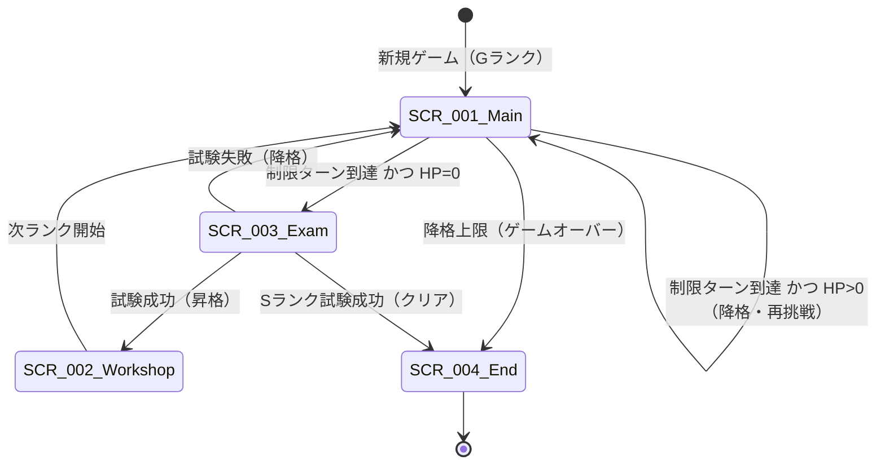

# UI設計概要

準拠要件: [`../../../spec/atelier-alchemy-core/requirements.md`](../../../spec/atelier-alchemy-core/requirements.md)
関連: [`../architecture.md`](../architecture.md)
デザイン方針: 水彩ファンタジースタイル（[`.claude/rules/design-guide.md`](../../../../.claude/rules/design-guide.md) に準拠）

> **信頼性レベル凡例**: 🔵 要件/コンセプト準拠 ／ 🟡 妥当な推測 ／ 🔴 新規推測
>
> 🔵 セーブ/ロード・タイトル・設定画面は現バージョンのスコープ外のため、UIは**メインゲーム中心**の最小構成とする。庭/調合/納品はシーン分割せず、メインゲーム画面内のフェーズUIパネルの表示切替で表現する。

---

## 画面一覧

| 画面ID | 画面名 | 説明 | 詳細ファイル |
|--------|--------|------|-------------|
| SCR-001 | メインゲーム画面 | ターンループの主画面。庭/調合/納品フェーズUIとHUDを内包 | [main-game.md](screens/main-game.md) |
| SCR-002 | 工房強化画面 | ランク間の恒久投資（投入枠+1・庭拡張・レシピ解禁） | [workshop-upgrade.md](screens/workshop-upgrade.md) |
| SCR-003 | 昇格試験画面 | 一発勝負の特殊局面（🟡 TBD 別途設計） | [promotion-exam.md](screens/promotion-exam.md) |
| SCR-004 | ゲーム終了画面 | クリア/ゲームオーバー表示 | （最小・本概要に統合） |

> 🟡 BootScene（初期化）はUIを持たないローディングのみ。タイトル/設定はスコープ外。

---

## 画面遷移図

---

## メインゲーム画面内のフェーズUI

🔵 v7.0は固定順序の依頼フローを廃止。庭/調合/納品はタブ的に自由に行き来できるパネルとして実装し、ターン終了で次ターンへ。

| フェーズUI | 役割 | アクセントカラー（🟡 参考） |
|-----------|------|---------------------------|
| 庭パネル（GardenPhaseUI） | 種の植付・収穫・種の指名買い | リーフグリーン (#8CC084) |
| 調合パネル（AlchemyPhaseUI）★核心 | 投入枠への配置・調合実行・プレビュー | アンバー (#D4A76A) |
| 納品結果（DeliveryResultUI） | 自動決算の結果確認（操作なし） | コーラル (#E8A87C) |

> 🟡 依頼受注フェーズは廃止済みのため、旧「ラベンダー」アクセントは日替わり指定調合物の表示に転用可。

---

## 共通UIコンポーネント

🔵 [`.claude/rules/design-guide.md`](../../../../.claude/rules/design-guide.md) のコンポーネント統一ルールに準拠。カード・パネル・ボタンは全フェーズ共通スタイル。

### カード / パネル（全フェーズ共通）
- 白背景・2px枠線・角丸12px・小さい影。ホバーで影拡大＋枠線強調、選択でフォーカスリング。
- 🔵 フェーズ独自のカード枠色・背景色をハードコードしない。

### ボタン（4種のみ）
| バリアント | 用途 |
|-----------|------|
| プライマリ（草色） | 調合実行・購入決定・ターン終了確定 |
| セカンダリ（枠線） | キャンセル・戻る |
| デンジャー | 破棄・危険操作 |
| ターシャリ | 最も控えめな操作 |

### ダイアログ
- 確認ダイアログ（購入・ターン終了など意思確認）／情報ダイアログ／エラーダイアログ。

### トランジション
- フェードイン/アウト（画面遷移デフォルト）／フェーズパネルはクロスフェード。

---

## デザイン規約

🔵 色・サイズは `shared/theme/theme.gd`（DesignTokens/Colors 相当）経由で参照し、ハードコード禁止（[`.claude/rules/design-guide.md`](../../../../.claude/rules/design-guide.md)）。以下は水彩ファンタジー基調の参考値（🟡 実装時に theme.gd で確定）。

### カラーパレット（参考）🟡

| 用途 | 参考値 | 説明 |
|------|--------|------|
| ブランド/プライマリ | 草色 | 確定アクション |
| 背景 | クリーム系（温かい） | ダーク背景は禁止 |
| カード背景 | 白 | 全フェーズ共通 |
| アクセント（ゴールド） | ゴールド | 強調 |
| テキスト | 濃いグレー | 本文 |
| エラー/成功 | status.error / status.success | 状態表示 |

> 🔵 青紫（#6366f1）などテーマ無関係な色・ダーク背景は禁止。

### フォント設定（参考）🟡
| 用途 | サイズ | ウェイト |
|------|--------|---------|
| 見出し | 大 | Bold |
| 本文 | 中 | Regular |
| キャプション | 小 | Light |

> 🔵 日本語テキストは画数の多い漢字（受・愛・変）の上部見切れに注意（Godotでも上部余白/行間に留意）。

### 角丸の基準
| 用途 | 値 |
|------|-----|
| バッジ・タグ | 6px |
| カード・パネル | 12px |
| ボタン | 18px |
| モーダル・トースト | 24px |

---

## アクセシビリティ要件

🟡（要件に明示はないがコンセプト「浅い理解でも作れて勝てる」に沿う）
- アイコン＋テキスト併記（品質グレード・特性の色＋ラベル）
- 適切なコントラスト（色覚多様性配慮：品質色・特性系統色に形状/ラベルも併用）
- キーボード操作対応（[`input-system.md`](input-system.md)）
- フォーカス表示（選択カードのフォーカスリング）

> 🔵 多言語対応・オンライン・実績は「やらないことリスト」（コンセプト2章）。
